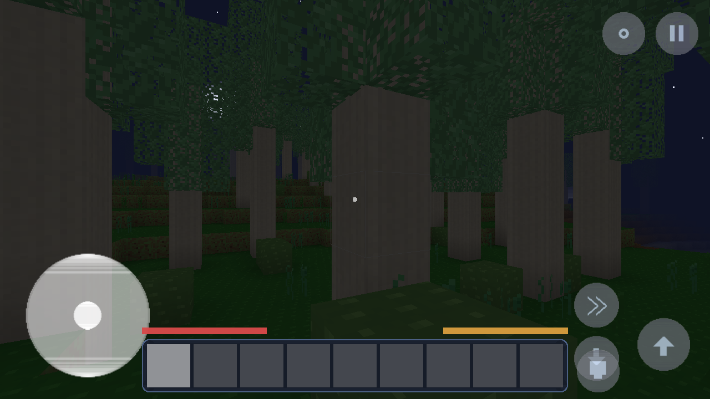

# Cubic World

*Shape the wild. Awaken the world.*

An original voxel sandbox survival game for Android, built from scratch with
**Kotlin + LibGDX**. Explore procedurally generated worlds humming with
Resonance, mine and build, craft through six original material tiers, survive
the night, and uncover the buried Worldheart.

Cubic World is an original game: every texture, sound, melody, block set,
creature, recipe, biome and piece of lore was created specifically for this
project (most of it generated procedurally by the scripts in `tools/`).



## Requirements

| What | Version used |
|---|---|
| JDK | 21 (compiles to Java 17 bytecode) |
| Android SDK | Platform 34, build-tools 34.0.0 |
| Gradle | 8.14.3 (a wrapper is included) |
| LibGDX | 1.13.1 |
| Kotlin | 2.0.21 |
| Android Gradle Plugin | 8.7.3 |
| Min Android | 5.0 (API 21), 64-bit and 32-bit ABIs included |

## Build

```bash
# point the build at your SDK (or create local.properties with sdk.dir=...)
export ANDROID_HOME=/path/to/android-sdk

./gradlew :android:assembleDebug         # -> android/build/outputs/apk/debug/android-debug.apk
./gradlew :core:test                     # run the unit/integration test suite
./gradlew :desktop:run                   # desktop dev build (same game code)
```

Install on a phone (enable "install unknown apps" for your file manager, or use adb):

```bash
adb install CubicWorld.apk
```

The debug APK is signed with the standard Android debug keystore, so it
installs directly without any private signing key.

### Desktop dev harness

The desktop launcher accepts JVM properties for automated testing:
`-Dcubic.autoplay=<seed>` (skip menus into a fresh world), `-Dcubic.autopilot=1`
(walk forward automatically), `-Dcubic.shots=<dir>` (periodic screenshots),
`-Dcubic.duration=<sec>`, `-Dcubic.time=<ticks>`, `-Dcubic.noaudio=1`,
`-Dcubic.no3d=1`. These exist only on desktop; none ship in gameplay UI.

## Controls (touch)

- **Left joystick** — walk; **swipe right side** — look around
- **Hold on a block** — mine it (ring shows progress); **tap** — place the
  selected block, open crates/stations, or strike a creature
- **Hold with food selected** — eat
- **Hotbar** — tap to select; **bag button** — pack + crafting
- **Buttons** — jump, sneak/descend, sprint, camera (1st/3rd back/3rd front), pause
- **Creative** — double-tap jump to toggle flight

## Architecture

```
core/    game code (shared by Android + desktop)
  world/       BlockRegistry, BiomeRegistry, ChunkData/Chunk, World,
               ChunkManager (async generate->decorate->light->active),
               LightingSystem (BFS sky+block light), SaveManager
    gen/       SeededNoise, WorldGenerator, Decorator (trees/plants/ruins)
  render/      ChunkMesher (worker-thread greedy face culling + AO + smooth
               light + biome tint), ChunkRenderer (3-pass: solid/cutout/
               translucent), SkyRenderer, EntityRenderer, TextureAtlasManager
  player/      PlayerController (AABB physics), Raycaster (DDA), Interaction,
               PlayerStats
  entity/      CreatureRegistry, Creature (state-machine AI), EntityManager
  inv/         ItemRegistry, RecipeRegistry, Inventory, CraftingManager,
               ContainerStore
  ui/          screens (menu/worlds/settings/game), Hud (touch controls),
               InventoryUi, UiSkin (programmatic)
  audio/       AudioManager (crossfading music/ambience, effect playback)
android/  launcher, manifest, adaptive icons
desktop/  LWJGL3 launcher + AutoShot test harness
assets/   data registries (JSON), generated texture atlas, generated audio,
          GLSL shaders
tools/    Python generators: gen_textures.py, gen_sounds.py, gen_icons.py
```

**Data-driven content**: blocks, items, recipes, biomes and creatures live in
`assets/data/*.json` (schema in `assets/data/SCHEMA.md`). The engine validates
every cross-reference at boot and fails with a readable error rather than
corrupting saves. Block ids are assigned by declaration order — the JSON is
append-only once a save format ships.

**World generation** is fully deterministic from the seed: identical seed +
world type produce identical terrain, decorations, ores and structures on any
device, regardless of chunk visit order (verified by unit test).

**Saves** are per-chunk DEFLATE-compressed binaries (only generated-and-
modified chunks are stored; everything else regenerates from the seed), with
versioned headers, atomic temp-file+rename writes and two rotating backups of
world metadata. Corrupt chunk files regenerate instead of crashing.

**Performance**: chunk meshes are built on worker threads from immutable
snapshots, uploaded with a per-frame budget, frustum-culled per 16x16x16
section, and only dirty sections rebuild after edits. Render distance and
simulation distance are separate settings with Low/Balanced/High presets.

## Current content (v0.1.0)

- 66 original blocks, 103 items, 54 recipes, 6 material tiers
  (wood/fiber -> flintstone -> copper alloy -> ironroot -> emberite -> starsteel)
- 8 biomes: Sunleaf Meadows, Whisperwood, Ruststone Barrens, Frostglass
  Expanse, Mirelight Fen, Azure Coast, Starfall Highlands, Gloomroot Depths
- 6 creatures with AI: Spriggle, Mossram, Glowmoth, Burrowbit (friendly),
  Duskling, Shardspine (hostile)
- 3 game modes (Survival / Creative / Explorer), 3 difficulties
  (Calm / Adventurous / Fierce), 4 world types
- Water + Glow Sap liquids, caves, ores, gravity blocks, crops & tilling,
  cooking stations, storage crates, Waystone ruins, day/night, weather,
  original synthesized soundtrack & effects

## Known limitations (honest list)

- Stairs, fences, doors, panes and waterlogging are not in v0.1.0 (the block
  schema reserves shapes for them).
- The Rune Loom, Pulsecraft automation, Wanderfolk, fishing, bows/spears,
  Cinderdeep and Aetherwild realms are designed in the roadmap but **not
  implemented** — no fake buttons for them exist.
- World export/import needs Android storage-access-framework work and is
  deferred; create/rename/duplicate/delete work.
- Third-person creature/player models are simple box rigs without limb
  animation.
- Lighting recomputes per chunk on edit (fast, but a large lantern farm can
  cause brief spikes on low-end phones).
- Tested on desktop GL + Android build tooling; see TEST_REPORT.md for the
  exact test matrix and what was **not** covered (no physical device was
  available in the build environment).

## License / credits

See [CREDITS.md](CREDITS.md). Engine: libGDX (Apache-2.0). All game content
is original to this project.
