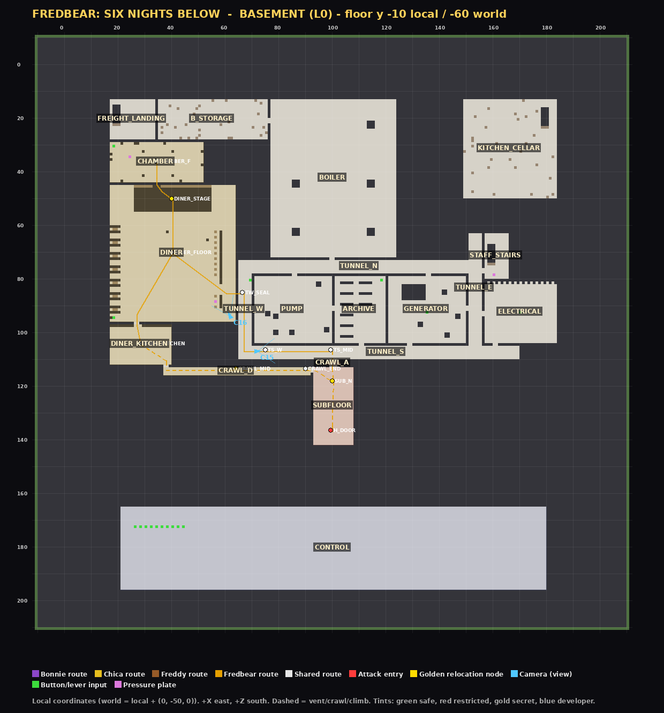
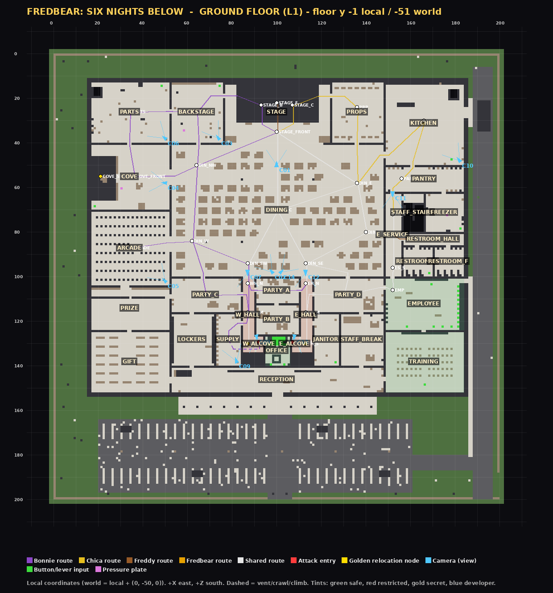
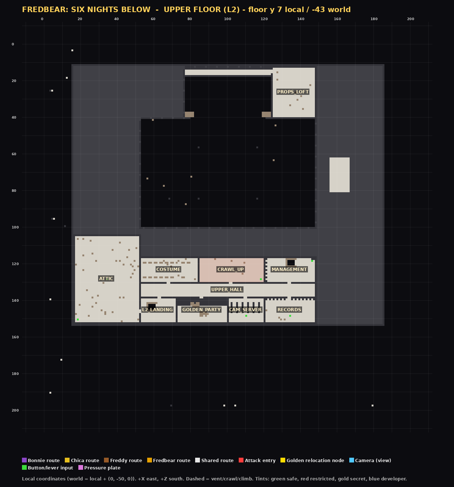

# 02 · Floor plan and coordinate registry

<!-- GENERATED by tools/gen_docs.mjs from the pack data. Do not edit by hand. -->

## Coordinate system

All map data is authored in **local coordinates**. World = local + ORIGIN, with ORIGIN = (0, -50, 0).
X runs west→east, Z runs north→south (Minecraft convention), Y is up.
The property spans local x 0..199, z 0..199 (a 200 × 200 footprint) on a plinth from local y undefined to undefined with a 10-block earth berm; outdoor grade is local y -1.

| Level | Name | Floor block y (local) | Standing y (local) | Standing y (world) |
|---|---|---|---|---|
| L0 | Basement | -10 | -9 | -59 |
| L1 | Ground floor | -1 | 0 | -50 |
| L2 | Upper floor | 7 | 8 | -42 |

Legend for the rendered plans: walls `#`, props `p`, glass `g`, floors `.`, grass `,`, roofs `r`; coloured overlays show room labels, AI nodes, route edges, cameras and inputs (tools/render_floorplans.py).

## Ticking areas (chunk loading)

| Name | From (world) | To (world) |
|---|---|---|
| fb_nw | -16 -64 -16 | 111 -20 111 |
| fb_ne | 112 -64 -16 | 239 -20 111 |
| fb_sw | -16 -64 112 | 111 -20 239 |
| fb_se | 112 -64 112 | 239 -20 239 |

Four ticking areas of 8 × 8 chunks keep the whole property, the basement and the command-block control room loaded at all times (created by the builder; `functions/fb/tickingareas.mcfunction` re-creates them).

## Anchors

| Anchor | Local x y z | World x y z | Yaw |
|---|---|---|---|
| lobbySpawn | 177.5 0 112.5 | 177.5 -50 112.5 | -90 |
| officeSeat | 100.5 0 131.5 | 100.5 -50 131.5 | 180 |
| officeEye | 100.5 1.6 131.5 | 100.5 -48.4 131.5 | - |
| trainingSpawn | 166.5 0 138.5 | 166.5 -50 138.5 | 0 |
| parkingSpawn | 100.5 0 178.5 | 100.5 -50 178.5 | 180 |
| controlRoom | 30.5 -9 180.5 | 30.5 -59 180.5 | -90 |
| endingCam | 34.5 -6.5 40.5 | 34.5 -56.5 40.5 | - |

Office interior bounds (local): x 95..105.999, z 127..139.999, y -0.5..6.

## Rooms (62)

Box = outer wall box `[x1, z1, x2, z2]` in local coordinates (walls included).

| ID | Name | Level | Box (local) | World NW corner | Zone | Purpose |
|---|---|---|---|---|---|---|
| PARTS | Parts & Service | L1 | 16, 12, 52, 40 | 16 -50 12 | staff | Spare endoskeletons and heads; freight stairs to the basement; CAM 06. |
| BACKSTAGE | Backstage | L1 | 52, 12, 76, 40 | 52 -50 12 | staff | Bonnie route node; spare-head shelves; CAM 03. |
| STAGE | Show Stage | L1 | 76, 12, 124, 40 | 76 -50 12 | public | Start positions of Freddy, Bonnie and Chica; lighting catwalk above; CAM 01. |
| PROPS | Prop & Costume Storage | L1 | 124, 12, 148, 40 | 124 -50 12 | staff | Costume racks and props; ladder to the stage loft. |
| KITCHEN | Kitchen | L1 | 148, 12, 184, 50 | 148 -50 12 | staff | Chica clatter and breaker sabotage; loading door; CAM 10 is audio-only. |
| COVE | Fredbear's Starlight Cove | L1 | 16, 40, 52, 70 | 16 -50 40 | public | Curtained side stage, OUT OF ORDER. Fredbear foreshadowing; CAM 04. |
| DINING | Main Dining Hall | L1 | 52, 40, 148, 100 | 52 -50 40 | public | Central hub joining every public route; CAM 02. |
| PANTRY | Pantry & Receiving | L1 | 148, 50, 184, 62 | 148 -50 50 | staff | Dry stores between kitchen and service corridor. |
| E_SERVICE | East Service Corridor | L1 | 148, 62, 156, 100 | 148 -50 62 | staff | Chica and Freddy staff route; CAM 11. |
| STAFF_STAIRS | Staff Stairwell | L1 | 156, 62, 166, 80 | 156 -50 62 | staff | Stairs to the basement maintenance tunnels. |
| FREEZER | Walk-in Freezer | L1 | 166, 62, 184, 80 | 166 -50 62 | staff | Cold storage, hanging chains; story note. |
| RESTROOM_HALL | Restroom Vestibule | L1 | 156, 80, 184, 86 | 156 -50 80 | public | Access to restrooms. |
| RESTROOM_M | Men's Restroom | L1 | 156, 86, 170, 100 | 156 -50 86 | public | Stalls, sinks; secret behind a mirror. |
| RESTROOM_F | Women's Restroom | L1 | 170, 86, 184, 100 | 170 -50 86 | public | Stalls, sinks; graffiti clue. |
| ARCADE | Arcade | L1 | 16, 70, 52, 104 | 16 -50 70 | public | Cabinet rows forming sightline breaks; Bonnie patrol; CAM 05. |
| PRIZE | Prize Counter | L1 | 16, 104, 52, 124 | 16 -50 104 | public | Prize shelves and ticket redemption. |
| GIFT | Gift Shop | L1 | 16, 124, 52, 152 | 16 -50 124 | public | Plush shelves; front-of-house loop. |
| PARTY_C | Party Room C | L1 | 52, 100, 84, 116 | 52 -50 100 | public | Links dining, prize counter and the west hall. |
| LOCKERS | Staff Lockers | L1 | 52, 116, 72, 140 | 52 -50 116 | staff | Lockers; previous guard notes. |
| SUPPLY | Supply Closet | L1 | 72, 116, 84, 140 | 72 -50 116 | staff | Bonnie's maintenance-duct shortcut to the west alcove; CAM 09. |
| W_HALL | West Hall | L1 | 84, 100, 90, 134 | 84 -50 100 | restricted | Left approach to the office; CAM 07. |
| W_ALCOVE | West Hall Corner | L1 | 90, 126, 94, 134 | 90 -50 126 | restricted | Blind corner outside the left door; lit by the left hall light; CAM 08. |
| PARTY_A | Party Room A | L1 | 90, 100, 110, 112 | 90 -50 100 | public | Cross-link between the halls (Bonnie flank route); CAM 14. |
| PARTY_B | Party Room B | L1 | 90, 112, 110, 126 | 90 -50 112 | public | Small party room north of the office. |
| OFFICE | Security Office | L1 | 94, 126, 106, 140 | 94 -50 126 | safe | Player station: doors, lights, cameras, power, strobe, hatch. |
| E_ALCOVE | East Hall Corner | L1 | 106, 126, 110, 134 | 106 -50 126 | restricted | Blind corner outside the right door; lit by the right hall light; CAM 13. |
| E_HALL | East Hall | L1 | 110, 100, 116, 134 | 110 -50 100 | restricted | Right approach to the office; CAM 12. |
| PARTY_D | Party Room D | L1 | 116, 100, 148, 116 | 116 -50 100 | public | Joins dining, east hall and the employee entrance. |
| JANITOR | Janitor Closet | L1 | 116, 116, 128, 140 | 116 -50 116 | staff | Mops, buckets; secret note. |
| STAFF_BREAK | Staff Break Room | L1 | 128, 116, 148, 140 | 128 -50 116 | staff | Break room; stairs to management. |
| EMPLOYEE | Employee Entrance (Time Clock) | L1 | 148, 100, 184, 124 | 148 -50 100 | safe | Campaign lobby: clock in to choose a night; staff door to the delivery road. |
| TRAINING | Training Room | L1 | 148, 124, 184, 152 | 148 -50 124 | safe | Tutorial briefing boards and the training start button. |
| RECEPTION | Reception & Ticket Counters | L1 | 52, 140, 148, 152 | 52 -50 140 | public | Front doors, ticket counters, public stairs to the upper floor. |
| L2_LANDING | Upper Landing | L2 | 52, 138, 72, 152 | 52 -42 138 | public | Top of the public stairs. |
| GOLDEN_PARTY | Golden Party Room | L2 | 72, 138, 100, 152 | 72 -42 138 | public | Old Fredbear-themed deluxe party room; story. |
| CAM_SERVER | Camera Server Room | L2 | 100, 138, 120, 152 | 100 -42 138 | staff | Camera racks; Night 5 pre-shift task; disruption sparks. |
| RECORDS | Records Room | L2 | 120, 138, 148, 152 | 120 -42 138 | staff | Incident files; Night 6 pre-shift task (Fredbear key). |
| UPPER_HALL | Upper Hall | L2 | 52, 130, 148, 138 | 52 -42 130 | staff | Connects every upper room. |
| COSTUME | Costume Storage | L2 | 52, 116, 84, 130 | 52 -42 116 | staff | Suit racks; spring-lock warning posters. |
| CRAWL_UP | Ceiling Crawlspace | L2 | 84, 116, 120, 130 | 84 -42 116 | restricted | Low crawlspace above the office; secret. |
| MANAGEMENT | Management Office | L2 | 120, 116, 148, 130 | 120 -42 116 | staff | Manager desk, safe, memos. |
| ATTIC | Attic Storage | L2 | 16, 104, 52, 152 | 16 -42 104 | staff | Boxed decorations; secret. |
| PROPS_LOFT | Stage Loft | L2 | 124, 12, 148, 40 | 124 -42 12 | staff | Rigging loft leading onto the stage catwalk. |
| FREIGHT_LANDING | Freight Landing | L0 | 16, 12, 34, 28 | 16 -59 12 | staff | Bottom of the freight stairs from Parts & Service. |
| B_STORAGE | Basement Storage | L0 | 34, 12, 76, 28 | 34 -59 12 | staff | Crates and retired decorations. |
| BOILER | Boiler & Machinery Hall | L0 | 76, 12, 124, 72 | 76 -59 12 | staff | Boilers, pipes and tanks below the stage and dining hall. |
| KITCHEN_CELLAR | Kitchen Cellar | L0 | 148, 12, 184, 50 | 148 -59 12 | staff | Cold cellar under the kitchen. |
| CHAMBER | Fredbear's Chamber | L0 | 16, 28, 52, 44 | 16 -59 28 | secret | Fredbear's dormant node and the campaign ending set. |
| DINER | Sealed Diner (Fredbear's Family Diner, 1983) | L0 | 16, 44, 64, 96 | 16 -59 44 | secret | The original diner the pizzeria was built over; Fredbear stirring node; CAM 16. |
| DINER_KITCHEN | Diner Back Kitchen | L0 | 16, 96, 40, 112 | 16 -59 96 | secret | Entrance to the old crawlspace. |
| CRAWL_D | Old Crawlspace | L0 | 36, 112, 92, 116 | 36 -59 112 | secret | Fredbear's hidden route toward the office subfloor. |
| TUNNEL_W | West Maintenance Tunnel | L0 | 64, 72, 70, 110 | 64 -59 72 | staff | Passes the bricked diner entrance. |
| TUNNEL_N | North Maintenance Tunnel | L0 | 70, 72, 150, 78 | 70 -59 72 | staff | Spine under the dining hall. |
| TUNNEL_S | South Maintenance Tunnel | L0 | 70, 104, 170, 110 | 70 -59 104 | staff | Spine under the party rooms. |
| TUNNEL_E | East Maintenance Tunnel | L0 | 150, 62, 156, 104 | 150 -59 62 | staff | Links the staff stairwell to the tunnels. |
| PUMP | Pump Room | L0 | 70, 78, 100, 104 | 70 -59 78 | staff | Water pumps and pipes. |
| ARCHIVE | Old Archive | L0 | 100, 78, 120, 104 | 100 -59 78 | staff | Diner-era records and newspaper clippings. |
| GENERATOR | Generator Room | L0 | 120, 78, 150, 104 | 120 -59 78 | staff | Main generator; Night 3 pre-shift and mid-night maintenance; CAM 15. |
| ELECTRICAL | Electrical Maintenance | L0 | 156, 80, 184, 104 | 156 -59 80 | staff | Breaker banks; Night 5 mid-night maintenance. |
| CRAWL_A | Subfloor Access | L0 | 97, 110, 103, 112 | 97 -59 110 | restricted | Short crawl from the south tunnel to the office subfloor. |
| SUBFLOOR | Office Subfloor | L0 | 92, 112, 108, 142 | 92 -59 112 | restricted | Crawlspace below the office leading to the maintenance hatch. |
| CONTROL | Command-Block Control Room | L0 | 20, 164, 180, 196 | 20 -59 164 | dev | Labelled command-block modules (developer area, under the parking lot). |

Openings: 83 doors, archways and windows. Stairs, ladders and the office hatch:

| ID | Kind | Local position | Direction | From → to standing y |
|---|---|---|---|---|
| PUBLIC_STAIRS | stairs | 54 142 | +x | 0 → 8 |
| MGMT_STAIRS | stairs | 130 118 | +x | 0 → 8 |
| FREIGHT_STAIRS | stairs | 18 15 | +z | 0 → -9 |
| STAFF_STAIRS | stairs | 158 67 | +z | 0 → -9 |
| CELLAR_STAIRS | stairs | 178 16 | +z | 0 → -9 |
| LOFT_LADDER | ladder | 146 30 | - | 0 → 8 |
| OFFICE_HATCH | hatch | 99 136 | - | -9 → 0 |
| VENT_DUCT | duct | undefined undefined | - | - → - |

## Security cameras (16)

| ID | Label | Room | Position (local) | Looks at (local) | Sees nodes | Farthest point from office seat | Notes |
|---|---|---|---|---|---|---|---|
| C01 | CAM 01 · SHOW STAGE | STAGE | 100.5 5 50.5 | 100.5 1.5 22.5 | STAGE_F, STAGE_B, STAGE_C, STAGE_FRONT | 109 blocks (7 chunks) | - |
| C02 | CAM 02 · DINING HALL WEST | DINING | 98.5 11 98.5 | 72 0 66 | DIN_NW, DIN_W, DIN_C, DIN_SW, STAGE_B, STAGE_F, STAGE_FRONT | 109 blocks (7 chunks) | - |
| C03 | CAM 03 · BACKSTAGE | BACKSTAGE | 74.5 4.5 38.5 | 58.5 0.5 15.5 | BACK | 123 blocks (8 chunks) | - |
| C04 | CAM 04 · STARLIGHT COVE | COVE | 50.5 2.8 58.5 | 21.5 1.5 55.5 | COVE_FRONT, COVE_STAGE | 110 blocks (7 chunks) | - |
| C05 | CAM 05 · ARCADE | ARCADE | 50.5 5.4 102.5 | 24.5 0.5 76.5 | ARCADE | 94 blocks (6 chunks) | - |
| C06 | CAM 06 · PARTS & SERVICE | PARTS | 50.5 5.4 38.5 | 22.5 0.5 14.5 | PARTS | 141 blocks (9 chunks) | - |
| C07 | CAM 07 · WEST HALL | W_HALL | 87.5 4.6 98.5 | 87.5 0.5 128.5 | WH_N, WH_M, WH_S | 35 blocks (3 chunks) | - |
| C08 | CAM 08 · WEST CORNER | W_ALCOVE | 91.5 4.6 127.5 | 92.5 0.8 132.5 | W_DOOR | 10 blocks (1 chunks) | - |
| C09 | CAM 09 · SUPPLY CLOSET | SUPPLY | 82.5 4.5 138.5 | 76.5 0.5 120.5 | SUP | 26 blocks (2 chunks) | - |
| C10 | CAM 10 · KITCHEN (AUDIO ONLY) | KITCHEN | 182.5 4.5 48.5 | 160.5 0.5 20.5 | KIT | 126 blocks (8 chunks) | audio only |
| C11 | CAM 11 · EAST SERVICE | E_SERVICE | 152.5 4.6 63.2 | 152.5 0.5 99.5 | ES_N, ES_M, ES_S, EMP | 86 blocks (6 chunks) | - |
| C12 | CAM 12 · EAST HALL | E_HALL | 113.5 4.6 98.5 | 113.5 0.5 128.5 | EH_N, EH_M, EH_S | 35 blocks (3 chunks) | - |
| C13 | CAM 13 · EAST CORNER | E_ALCOVE | 108.5 4.6 127.5 | 107.5 0.8 132.5 | E_DOOR | 9 blocks (1 chunks) | - |
| C14 | CAM 14 · DINING HALL EAST | DINING | 102.5 11 98.5 | 140.5 0 62.5 | DIN_E, DIN_EE, DIN_SE, STAGE_C | 108 blocks (7 chunks) | - |
| C15 | CAM 15 · MAINTENANCE TUNNEL | TUNNEL_S | 72.5 -4.6 107.5 | 110.5 -9 107 | TS_W, TS_MID | 37 blocks (3 chunks) | - |
| C16 | CAM 16 · SEALED DINER | DINER | 62.5 -4.6 94.5 | 40.5 -8 50.5 | DINER_STAGE, DINER_FLOOR | 101 blocks (7 chunks) | no signal before night 4 |

**Rendering reach.** Camera views move the player's *view* (`minecraft:free` camera) but not the player, so what a feed can show is limited by what the client has loaded around the player in the office. The farthest point any feed must show is 141 blocks (9 chunks) from the office seat. Ticking areas keep those chunks *simulated* (puppets keep being teleported and synced) but do not by themselves make them *render*; set the render distance to at least 11 chunks (docs/08_INSTALL_AND_PLAY.md). Whether distant feeds render correctly at lower settings has not been verified in-game.

## AI route graph

47 nodes and 57 edges. Every edge is a polyline of waypoints the puppet follows; tools/validate_map.mjs samples every 0.5 blocks of every polyline against the voxel model (body + head cells must be passable), and the in-game self-test repeats the check against the built world.
Access letters: B = bonnie, C = chica, F = freddy, G = fredbear. Entries: L → W_DOOR (barrier door_l), R → E_DOOR (barrier door_r), H → H_DOOR (barrier hatch). Fredbear's golden nodes: COVE_STAGE, WH_S, EH_S, DINER_STAGE, CRAWL_MID, SUB_N.

| Node | Room | Local x y z | Flags | Seen by |
|---|---|---|---|---|
| STAGE_F | STAGE | 100.5 1 22.5 | home of freddy, zone far | C01, C02 |
| STAGE_B | STAGE | 93.5 1 23.5 | home of bonnie, zone far | C01, C02 |
| STAGE_C | STAGE | 107.5 1 23.5 | home of chica, zone far | C01, C14 |
| STAGE_FRONT | STAGE | 100.5 0 35.5 | zone far | C01, C02 |
| BACK | BACKSTAGE | 64.5 0 26.5 | zone far | C03 |
| PARTS | PARTS | 34.5 0 26.5 | dark, zone far | C06 |
| PRP | PROPS | 136.5 0 24.5 | dark, zone far | - |
| DIN_NW | DINING | 64.5 0 50.5 | zone mid | C02 |
| DIN_W | DINING | 62.5 0 84.5 | zone mid | C02 |
| DIN_C | DINING | 100.5 0 70.5 | zone mid | C02 |
| DIN_E | DINING | 136.5 0 58.5 | zone mid | C14 |
| DIN_EE | DINING | 140.5 0 80.5 | zone mid | C14 |
| DIN_SW | DINING | 87.5 0 94.5 | zone mid | C02 |
| DIN_SE | DINING | 113.5 0 94.5 | zone mid | C14 |
| COVE_FRONT | COVE | 36.5 0 55.5 | dark, zone far | C04 |
| COVE_STAGE | COVE | 21.5 1 55.5 | golden, dark, zone far | C04 |
| ARCADE | ARCADE | 34.5 0 87.5 | zone far | C05 |
| PC | PARTY_C | 68.5 0 108.5 | zone mid | - |
| SUP | SUPPLY | 78.5 0 128.5 | dark, zone near | C09 |
| WH_N | W_HALL | 87.5 0 103.5 | dark, zone mid | C07 |
| WH_M | W_HALL | 87.5 0 116.5 | dark, zone near | C07 |
| WH_S | W_HALL | 87.5 0 130.5 | golden, dark, zone near | C07 |
| W_DOOR | W_ALCOVE | 92.5 0 130 | dark, entry L, zone entry | C08 |
| PA | PARTY_A | 100.5 0 106.5 | zone mid | - |
| EH_N | E_HALL | 113.5 0 103.5 | dark, zone mid | C12 |
| EH_M | E_HALL | 113.5 0 116.5 | dark, zone near | C12 |
| EH_S | E_HALL | 113.5 0 130.5 | golden, dark, zone near | C12 |
| E_DOOR | E_ALCOVE | 107.5 0 130 | dark, entry R, zone entry | C13 |
| PD | PARTY_D | 130.5 0 108.5 | zone mid | - |
| EMP | EMPLOYEE | 152.5 0 106.5 | zone mid | C11 |
| KIT | KITCHEN | 166.5 0 30.5 | dark, kitchen, zone far | C10 |
| PAN | PANTRY | 156.5 0 56.5 | dark, zone far | - |
| ES_N | E_SERVICE | 152.5 0 72.5 | dark, zone mid | C11 |
| ES_M | E_SERVICE | 152.5 0 81.5 | dark, zone mid | C11 |
| ES_S | E_SERVICE | 152.5 0 96.5 | dark, zone mid | C11 |
| RH | RESTROOM_HALL | 162.5 0 83.5 | dark, zone mid | - |
| CHAMBER_F | CHAMBER | 34.5 -9 36.5 | home of fredbear, dark, zone far | - |
| DINER_STAGE | DINER | 40.5 -8 50.5 | golden, dark, zone far | C16 |
| DINER_FLOOR | DINER | 40.5 -9 70.5 | dark, zone far | C16 |
| DINER_KITCHEN | DINER_KITCHEN | 28.5 -9 104.5 | dark, zone far | - |
| CRAWL_MID | CRAWL_D | 64.5 -9 114 | golden, dark, crawl, zone mid | - |
| CRAWL_END | CRAWL_D | 90.5 -9 114 | dark, crawl, zone near | - |
| TW_SEAL | TUNNEL_W | 67 -9 85.5 | dark, zone mid | - |
| TS_W | TUNNEL_S | 75.5 -9 107 | dark, zone mid | C15 |
| TS_MID | TUNNEL_S | 100 -9 107 | dark, zone mid | C15 |
| SUB_N | SUBFLOOR | 100.5 -9 118.5 | golden, dark, zone near | - |
| H_DOOR | SUBFLOOR | 100 -2.2 137 | dark, entry H, zone entry | - |

| Edge | Access | Mode | Gate | Length (blocks) | Waypoints |
|---|---|---|---|---|---|
| STAGE_B ↔ STAGE_FRONT | B | walk | - | 16.8 | 5 |
| STAGE_C ↔ STAGE_FRONT | C | walk | - | 16.8 | 5 |
| STAGE_F ↔ STAGE_FRONT | F | walk | - | 13.6 | 5 |
| STAGE_B ↔ BACK | B | walk | - | 34.1 | 7 |
| STAGE_C ↔ PRP | C | walk | - | 32.6 | 7 |
| BACK ↔ DIN_NW | B | walk | - | 24.0 | 4 |
| BACK ↔ PARTS | B | walk | - | 30.0 | 4 |
| PARTS ↔ COVE_FRONT | B | walk | - | 29.2 | 4 |
| PRP ↔ DIN_E | C | walk | - | 34.0 | 4 |
| STAGE_FRONT ↔ DIN_NW | B | walk | - | 39.0 | 2 |
| STAGE_FRONT ↔ DIN_C | BCF | walk | - | 35.0 | 2 |
| STAGE_FRONT ↔ DIN_E | CF | walk | - | 42.7 | 2 |
| DIN_NW ↔ DIN_W | B | walk | - | 34.1 | 2 |
| DIN_NW ↔ COVE_FRONT | B | walk | - | 29.0 | 4 |
| DIN_W ↔ ARCADE | B | walk | - | 28.2 | 3 |
| DIN_W ↔ DIN_SW | B | walk | - | 26.9 | 2 |
| DIN_C ↔ DIN_SW | BF | walk | - | 27.3 | 2 |
| DIN_C ↔ DIN_SE | CF | walk | - | 27.3 | 2 |
| DIN_C ↔ DIN_E | CF | walk | - | 37.9 | 2 |
| DIN_E ↔ DIN_EE | CF | walk | - | 22.4 | 2 |
| DIN_EE ↔ DIN_SE | CF | walk | - | 30.4 | 2 |
| DIN_SW ↔ WH_N | B | walk | - | 9.0 | 3 |
| DIN_W ↔ PC | B | walk | - | 24.9 | 4 |
| PC ↔ WH_M | B | walk | - | 26.6 | 4 |
| WH_N ↔ WH_M | B | walk | - | 13.0 | 2 |
| WH_M ↔ WH_S | BG | walk | - | 14.0 | 2 |
| WH_S ↔ W_DOOR | BFG | walk | - | 5.0 | 3 |
| WH_M ↔ SUP | B | walk | - | 17.9 | 5 |
| SUP ↔ W_DOOR | B | vent | - | 22.2 | 6 |
| WH_N ↔ PA | B | walk | - | 14.7 | 4 |
| PA ↔ EH_N | B | walk | - | 14.2 | 4 |
| DIN_SE ↔ EH_N | BCF | walk | - | 9.0 | 3 |
| EH_N ↔ EH_M | BCF | walk | - | 13.0 | 2 |
| EH_M ↔ EH_S | BCFG | walk | - | 14.0 | 2 |
| EH_S ↔ E_DOOR | BCFG | walk | - | 6.0 | 3 |
| DIN_E ↔ KIT | C | walk | - | 42.3 | 4 |
| KIT ↔ PAN | C | walk | - | 28.5 | 4 |
| PAN ↔ ES_N | C | walk | - | 18.0 | 4 |
| ES_N ↔ ES_M | CF | walk | - | 9.0 | 2 |
| ES_M ↔ ES_S | CF | walk | - | 15.0 | 2 |
| DIN_EE ↔ ES_M | CF | walk | - | 12.1 | 4 |
| ES_M ↔ RH | F | walk | - | 10.4 | 4 |
| ES_S ↔ EMP | CF | walk | - | 10.1 | 4 |
| EMP ↔ PD | CF | walk | - | 22.7 | 4 |
| PD ↔ EH_M | CF | walk | - | 24.6 | 4 |
| PD ↔ DIN_SE | CF | walk | - | 29.1 | 4 |
| CHAMBER_F ↔ DINER_STAGE | G | walk | chamber_wall | 17.3 | 6 |
| DINER_STAGE ↔ DINER_FLOOR | G | walk | - | 20.6 | 4 |
| DINER_FLOOR ↔ DINER_KITCHEN | G | walk | - | 37.8 | 4 |
| DINER_KITCHEN ↔ CRAWL_MID | G | crawl | - | 41.2 | 4 |
| CRAWL_MID ↔ CRAWL_END | G | crawl | - | 26.0 | 2 |
| CRAWL_END ↔ SUB_N | G | crawl | - | 11.3 | 3 |
| SUB_N ↔ H_DOOR | G | climb | - | 25.3 | 4 |
| DINER_FLOOR ↔ TW_SEAL | G | walk | diner_seal | 31.5 | 4 |
| TW_SEAL ↔ TS_W | G | walk | - | 30.0 | 3 |
| TS_W ↔ TS_MID | G | walk | - | 24.5 | 2 |
| TS_MID ↔ SUB_N | G | crawl | - | 11.5 | 3 |

## Player route guidance

The green breadcrumb sparkles (introduction, optional tasks, maintenance) follow a walkable waypoint graph generated from the voxel model by `tools/gen_guide.mjs`: 1770 nodes (a 6-block grid in every room, both sides of every doorway, every stairway and the ladder, every control) and 3038 edges, each a straight line a player can walk both ways under the map validator's rules (steps, drops, no squeezing past corners). The game runs Dijkstra from the target and lays sparkles along the next 14 blocks of the real route.

| From | To | Walking distance | Rooms on the way |
|---|---|---|---|
| Time clock | Security office | 105 blocks | Employee Entrance (Time Clock) → Party Room D → East Hall → Security Office |
| Security office | GENERATOR RESTART | 181 blocks | Security Office → East Hall Corner → East Hall → Party Room D → Employee Entrance (Time Clock) → East Service Corridor → Staff Stairwell → East Maintenance Tunnel → Generator Room |
| Security office | BREAKER BANK B | 182 blocks | Security Office → East Hall Corner → East Hall → Party Room D → Employee Entrance (Time Clock) → East Service Corridor → Staff Stairwell → East Maintenance Tunnel → Electrical Maintenance |
| Time clock | Night 2 task | 120 blocks | Employee Entrance (Time Clock) → East Service Corridor → Pantry & Receiving → Kitchen |
| Time clock | Night 3 task | 135 blocks | Employee Entrance (Time Clock) → East Service Corridor → Staff Stairwell → East Maintenance Tunnel → Generator Room |
| Time clock | Night 4 task | 195 blocks | Employee Entrance (Time Clock) → East Service Corridor → Staff Stairwell → East Maintenance Tunnel → North Maintenance Tunnel → West Maintenance Tunnel |
| Time clock | Night 5 task | 163 blocks | Employee Entrance (Time Clock) → Party Room D → Staff Break Room → Management Office → Upper Hall → Camera Server Room |
| Time clock | Night 6 task | 139 blocks | Employee Entrance (Time Clock) → Party Room D → Staff Break Room → Management Office → Upper Hall → Records Room |

## Command-block control room

Underground at local y -9 (world -59), x 22..177, in 9 rows at local z 169, 172, 175, 178, 181, 184, 187, 190, 193. Each of the 111 actuator modules is a redstone-block pad, an impulse block and its chain (east-facing). The full block-by-block register is docs/06_COMMAND_BLOCK_REGISTER.md.

## Inputs (78)

Every physical control sits on a console block; the impulse command block one block below it runs `scriptevent fb:input <action>`. The script accepts an input only if the event comes from the registered block position.

| ID | Action | Control | Control (local) | Command block (world) | Label |
|---|---|---|---|---|---|
| in.office.door_l | `door_l` | button | 96 0 130 | 96 -51 130 | LEFT DOOR |
| in.office.light_l | `light_l` | button | 97 0 130 | 97 -51 130 | LEFT LIGHT |
| in.office.cams | `cams_toggle` | button | 98 0 130 | 98 -51 130 | MONITOR |
| in.office.hatch | `hatch` | button | 99 0 130 | 99 -51 130 | HATCH |
| in.office.strobe | `strobe` | button | 100 0 130 | 100 -51 130 | STROBE |
| in.office.breaker | `breaker` | button | 101 0 130 | 101 -51 130 | RESET BREAKER |
| in.office.phone | `phone` | button | 102 0 130 | 102 -51 130 | PHONE |
| in.office.light_r | `light_r` | button | 103 0 130 | 103 -51 130 | RIGHT LIGHT |
| in.office.door_r | `door_r` | button | 104 0 130 | 104 -51 130 | RIGHT DOOR |
| in.office.reserve | `reserve` | lever | 97 0 139 | 97 -51 139 | EMERGENCY RESERVE |
| in.office.start | `start_shift` | button | 103 0 139 | 103 -51 139 | START / RESUME SHIFT |
| in.office.map_c06 | `cam:C06` | button | 98 0 127 | 98 -51 127 | CAM 06 · PARTS & SERVICE |
| in.office.map_c03 | `cam:C03` | button | 99 0 127 | 99 -51 127 | CAM 03 · BACKSTAGE |
| in.office.map_c01 | `cam:C01` | button | 100 0 127 | 100 -51 127 | CAM 01 · SHOW STAGE |
| in.office.map_c02 | `cam:C02` | button | 101 0 127 | 101 -51 127 | CAM 02 · DINING HALL WEST |
| in.office.map_c10 | `cam:C10` | button | 102 0 127 | 102 -51 127 | CAM 10 · KITCHEN (AUDIO ONLY) |
| in.office.map_c11 | `cam:C11` | button | 103 0 127 | 103 -51 127 | CAM 11 · EAST SERVICE |
| in.office.map_c04 | `cam:C04` | button | 98 0 128 | 98 -51 128 | CAM 04 · STARLIGHT COVE |
| in.office.map_c05 | `cam:C05` | button | 99 0 128 | 99 -51 128 | CAM 05 · ARCADE |
| in.office.map_c07 | `cam:C07` | button | 100 0 128 | 100 -51 128 | CAM 07 · WEST HALL |
| in.office.map_c14 | `cam:C14` | button | 101 0 128 | 101 -51 128 | CAM 14 · DINING HALL EAST |
| in.office.map_c12 | `cam:C12` | button | 102 0 128 | 102 -51 128 | CAM 12 · EAST HALL |
| in.office.map_c15 | `cam:C15` | button | 103 0 128 | 103 -51 128 | CAM 15 · MAINTENANCE TUNNEL |
| in.office.map_c16 | `cam:C16` | button | 98 0 129 | 98 -51 129 | CAM 16 · SEALED DINER |
| in.office.map_c09 | `cam:C09` | button | 99 0 129 | 99 -51 129 | CAM 09 · SUPPLY CLOSET |
| in.office.map_c08 | `cam:C08` | button | 100 0 129 | 100 -51 129 | CAM 08 · WEST CORNER |
| in.office.map_c13 | `cam:C13` | button | 102 0 129 | 102 -51 129 | CAM 13 · EAST CORNER |
| in.lobby.tutorial | `lobby:tutorial` | button | 181 0 104 | 181 -51 104 | TRAINING SHIFT |
| in.lobby.night_1 | `lobby:night:1` | button | 181 0 106 | 181 -51 106 | NIGHT 1 |
| in.lobby.night_2 | `lobby:night:2` | button | 181 0 108 | 181 -51 108 | NIGHT 2 |
| in.lobby.night_3 | `lobby:night:3` | button | 181 0 110 | 181 -51 110 | NIGHT 3 |
| in.lobby.night_4 | `lobby:night:4` | button | 181 0 112 | 181 -51 112 | NIGHT 4 |
| in.lobby.night_5 | `lobby:night:5` | button | 181 0 114 | 181 -51 114 | NIGHT 5 |
| in.lobby.night_6 | `lobby:night:6` | button | 181 0 116 | 181 -51 116 | NIGHT 6 |
| in.lobby.night_7 | `lobby:night:7` | button | 181 0 118 | 181 -51 118 | NIGHT 7 |
| in.lobby.continue | `lobby:continue` | button | 181 0 120 | 181 -51 120 | CONTINUE |
| in.lobby.free_roam | `lobby:free_roam` | button | 181 0 122 | 181 -51 122 | FREE ROAM |
| in.lobby.settings | `lobby:settings` | button | 178 0 122 | 178 -51 122 | SETTINGS |
| in.lobby.extras | `lobby:extras` | button | 174 0 122 | 174 -51 122 | ARCHIVE & CREDITS |
| in.lobby.reset | `lobby:reset` | button | 170 0 122 | 170 -51 122 | ERASE PROGRESS |
| in.lobby.challenges | `lobby:challenges` | button | 158 0 122 | 158 -51 122 | CHALLENGES |
| in.lobby.clippings | `lobby:clippings` | button | 169 0 103 | 169 -51 103 | READ CLIPPINGS |
| in.training.begin | `lobby:tutorial` | button | 166 0 148 | 166 -51 148 | BEGIN TRAINING |
| in.maint.kitchen_breaker | `maint:kitchen_breaker` | button | 178 0 47 | 178 -51 47 | KITCHEN BREAKER PANEL |
| in.maint.generator | `maint:generator` | lever | 135 -9 92 | 135 -60 92 | GENERATOR RESTART |
| in.maint.diner_wall | `maint:diner_wall` | button | 69 -9 80 | 69 -60 80 | SEALED WALL INSPECTION |
| in.maint.electrical | `maint:electrical` | lever | 170 -9 92 | 170 -60 92 | BREAKER BANK B |
| in.maint.cam_server | `maint:cam_server` | button | 110 8 148 | 110 -43 148 | CAMERA SERVER REBOOT |
| in.maint.records_key | `maint:records_key` | button | 134 8 148 | 134 -43 148 | FILE CABINET F-87 |
| in.secret.01 | `secret:01` | button | 48 0 14 | 48 -51 14 | Parts bin |
| in.secret.02 | `secret:02` | button | 74 0 14 | 74 -51 14 | Spare head shelf |
| in.secret.03 | `secret:03` | button | 18 0 68 | 18 -51 68 | Cove backstage |
| in.secret.04 | `secret:04` | button | 182 0 78 | 182 -51 78 | Freezer crate |
| in.secret.05 | `secret:05` | button | 168 0 98 | 168 -51 98 | Restroom mirror |
| in.secret.06 | `secret:06` | button | 126 0 138 | 126 -51 138 | Janitor bucket |
| in.secret.07 | `secret:07` | button | 18 8 150 | 18 -43 150 | Attic box |
| in.secret.08 | `secret:08` | button | 146 8 118 | 146 -43 118 | Manager's safe |
| in.secret.09 | `secret:09` | button | 118 -9 80 | 118 -60 80 | Archive drawer |
| in.secret.10 | `secret:10` | button | 18 -9 94 | 18 -60 94 | Diner jukebox |
| in.secret.11 | `secret:11` | button | 18 -9 30 | 18 -60 30 | Golden shrine |
| in.secret.12 | `secret:12` | button | 118 8 128 | 118 -43 128 | Crawlspace note |
| in.zone.cove | `zone:cove` | plate | 30 0 60 | 30 -52 60 | Starlight Cove |
| in.zone.backstage | `zone:backstage` | plate | 58 0 34 | 58 -52 34 | Backstage |
| in.zone.freezer | `zone:freezer` | plate | 176 0 72 | 176 -52 72 | Freezer |
| in.zone.basement | `zone:basement` | plate | 160 -9 78 | 160 -61 78 | Basement |
| in.zone.diner | `zone:diner` | plate | 56 -9 88 | 56 -61 88 | Sealed diner |
| in.zone.chamber | `zone:chamber` | plate | 24 -9 34 | 24 -61 34 | Fredbear's chamber |
| in.zone.attic | `zone:attic` | button | 34 8 128 | 34 -43 128 | Attic light switch |
| in.dev.exit | `dev:exit` | button | 26 -9 166 | 26 -60 166 | EXIT TO LOBBY |
| in.dev.selftest | `dev:selftest` | button | 28 -9 166 | 28 -60 166 | SELF-TEST |
| in.dev.overlay | `dev:overlay` | button | 30 -9 166 | 30 -60 166 | DEBUG OVERLAY |
| in.dev.deterministic | `dev:deterministic` | button | 32 -9 166 | 32 -60 166 | DETERMINISTIC SEED |
| in.dev.menu | `dev:menu` | button | 34 -9 166 | 34 -60 166 | DEBUG MENU |
| in.dev.graph | `dev:graph` | button | 36 -9 166 | 36 -60 166 | VALIDATE ROUTES |
| in.dev.state | `dev:state` | button | 38 -9 166 | 38 -60 166 | DUMP STATE |
| in.dev.puppets | `dev:puppets` | button | 40 -9 166 | 40 -60 166 | RESPAWN PUPPETS |
| in.dev.skip_hour | `dev:skip_hour` | button | 42 -9 166 | 42 -60 166 | SKIP HOUR |
| in.dev.reset | `dev:reset` | button | 44 -9 166 | 44 -60 166 | FULL RESET |
