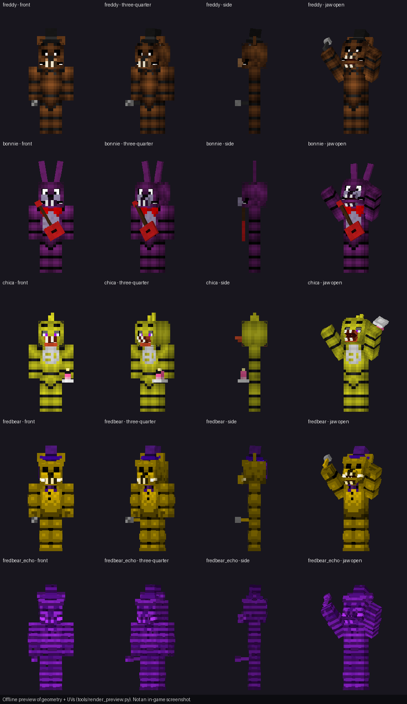

# 07 · Construction procedure and assets

The map is not shipped as a world file. It is **constructed in your own world by the behavior pack** from a
deterministic build plan (`scripts/data/build_plan.js`), so it can be rebuilt, repaired and checked at any time.
The same plan drives the offline voxel model used by every map test, and the integration tests prove that the
in-game builder produces exactly that model (docs/10).

## Stage 0 — world requirements

* A **Flat** world (default flat preset: grass at y −61). The plinth is built from y −61 to y −52 and everything
  above is cleared, so other terrain also works, but Flat avoids caves and water under the property.
* Cheats **on** (needed for `/fb:setup` and for command blocks), behavior pack **FREDBEAR: Six Nights Below (Behavior)**
  active (it pulls in the resource pack as a dependency). No experiments.
* Stand anywhere; the build area is world x −12..211, z −12..211, y −61..−10.

## Stage 1 — `/fb:setup` (automatic)

`/fb:setup` (or `/function fb/setup`) starts `Builder.start()`:

1. **Palette check.** All 253 block permutations are resolved with `BlockPermutation.resolve`; any failure is reported.
2. **World policy.** `gamerule commandblocksenabled true`, `commandblockoutput false`, `sendcommandfeedback false`,
   no daylight/weather cycles, no mob spawning, `time set 18000`.
3. **Ticking areas** `fb_nw`, `fb_ne`, `fb_sw`, `fb_se` (8 × 8 chunks each, docs/02).
4. **Wait for chunks**: 197 probe points must report loaded.
5. **Plan phases** (time-sliced with `system.runJob`; fills above 32,768 blocks are split into columns, one per job step):

   | Phase | Operations | Blocks written | Contents |
   |---|---:|---:|---|
   | terrain | 123 | 2,611,384 | clear the volume, plinth, earth berm |
   | shell | 682 | 516,735 | floors, walls, ceilings and roofs of the 62 rooms by style, structural solids, brick façade |
   | openings | 147 | 1,642 | doors, archways, windows (boarded where broken) |
   | stairs | 389 | 1,349 | 8 stairways/ladders/hatch with railings |
   | decor | 772 | 11,799 | room kits (≈50): stage, tables, arcade cabinets, kitchen, parts bins, posters, webs, lights… |
   | exterior | 188 | 11,045 | plaza, parking, roads, loading dock and truck, fence, dead trees, rooftop billboard |
   | consoles | 8 | 69 | console blocks under every control |
   | *(structures)* | 30 | 448 | command-block structure files, see below |
   | controls | 4 | 75 | buttons, levers on the consoles |
   | signs | 196 | 196 | room story signs, control labels, control-room labels (waxed) |

   Progress is saved in `fb:build` every 24 operations: if the world closes, run `/fb:setup` again and it resumes.
6. **Command blocks.** After the consoles phase, each of the 30 files in `structures/fb/` is placed with
   `world.structureManager.place()` at the origin listed in docs/06 "Structure files".
7. **Verification.** Every input command block must exist where registered; errors are listed in a *Build report* form.
8. **Lobby.** A full reset puts you at the time clock.

`/fb:setup true` (or `/function fb/rebuild`) rebuilds from scratch. Run `/fb:debug selftest` afterwards: it should
report 9 PASS lines (palette, structures, command blocks in place, actuator round trip, heartbeat, AI routes clear,
camera positions in open air, one puppet per animatronic, chunks loaded).

## Stage 2 — manual fallback for command blocks

Only needed if the self-test reports missing command blocks or a failed round trip.

1. **Load the structure files by hand.** For each row of docs/06 "Structure files":
   `/structure load fb:cb_row_0 23 -59 169` (identifier, then the world origin). A Structure Block in *Load* mode with
   the same name and offset works too.
2. **If a structure cannot be loaded at all**, rebuild its modules from docs/06 "Every command block" (or
   `docs/command_blocks.csv`). For each row: place the block type at the listed world coordinates facing the listed
   direction (modules face **east**, input blocks face **up**), set *Unconditional*, set *Needs Redstone* for impulse
   blocks and *Always Active* for chain/repeating blocks, enter the tick delay and paste the exact command.
   The first (impulse) block of each module sits one block east of its redstone pad and its command clears that pad.
3. Re-run `/fb:debug selftest`.

## Resource pack assets

All art derives from the four skins supplied by the map owner (`art/skins/`, unmodified). `tools/gen_rp.py` regenerates
every file below deterministically.

| Asset | Files | Notes |
|---|---|---|
| Textures | `textures/entity/fb/{freddy,bonnie,chica,fredbear,fredbear_echo}.png` (128×64) | left half = the supplied 64×64 skin; right half = accessory atlas. Chica's skin is legacy 64×32 and is converted to 64×64 with the standard legacy-skin conversion (left arm and leg mirrored from the right ones, outer faces swapped) |
| Eye layers | `*_eyes.png` | only the pupils (taken from each skin's face) are opaque; drawn with the vanilla `creaking_eyes` material and `ignore_lighting`, shown when `fb:eyes` is true |
| Fredbear echo | `fredbear_echo.png` | purple, scan-lined, partly broken copy used for false camera events |
| Geometry | `models/entity/fb_<name>.geo.json` (format 1.21.0) | the vanilla `geometry.humanoid.custom` bone set and UVs (head + hat layer, body + jacket, arms + sleeves, legs + pants) plus `snout`, `jaw`, `leftEar`, `rightEar`, `crown`, `prop` |
| Accessories | in the atlas | Freddy: round ears, black top hat, microphone. Bonnie: long ears with inner colour, red guitar (shown only while performing). Chica: orange beak and lower beak with teeth, head tuft, cupcake on a plate. Fredbear: round ears with purple inner, purple top hat, microphone. Bow ties and Chica's bib come from the supplied skins |
| Animations | `animations/fb_animatronic.animation.json` | idle, perform, walk, stalk, crawl, look (head turns), pause (suspicious freeze), threat (doorway), attack (jumpscare lunge, jaw open), retreat, dormant, music |
| Animation controller | `controller.animation.fb.pose` | one state per `fb:anim` value, 0.2 s blends (0.05 s into attack) |
| Render controllers | `controller.render.fb.animatronic`, `controller.render.fb.eyes` | `fb:hidden` hides the whole model (vent crawls) |
| Sounds | `sounds/fb/**.ogg` (48 ids), `sounds/sound_definitions.json` | synthesised by `tools/gen_sounds.py`: footsteps per character, door/light/camera/power/breaker/strobe devices, clock chimes, phone, ambience, groan, breathing, kitchen clatter, laughter, music boxes, roar, glitch, four jumpscare screams, finale, ending theme. Freddy's music box plays Bizet's *Toreador March* (public domain); all other melodies are original |
| Fogs | `fogs/fb_night_{1..6}.json` | darker and closer each night (`fog @a push fb:night_<n> fb_night`) |
| Items | `textures/items/fb_{tablet,remote,guide}.png`, `textures/item_texture.json` | 16×16 icons |
| Text | `texts/en_US.lang`, `texts/languages.json` | entity and item names |
| Pack icons | `pack_icon.png` in both packs | faces from the supplied skins |



The preview sheet is rendered offline by `tools/render_preview.py` from the geometry and textures (front, three-quarter,
side, and the attack pose). It checks UV mapping and accessory placement; **it is not an in-game screenshot**.

## Regenerating everything

```
npm install          # pinned typings + TypeScript (dev only)
npm run build        # structures, register, floor plans, RP art/sounds, previews, generated docs, dist/
npm run validate     # six static validators
npm test             # unit, structure and integration tests
```

Python 3 with Pillow and numpy, ffmpeg with libvorbis, and `jsonschema` are needed for the asset and schema steps.
