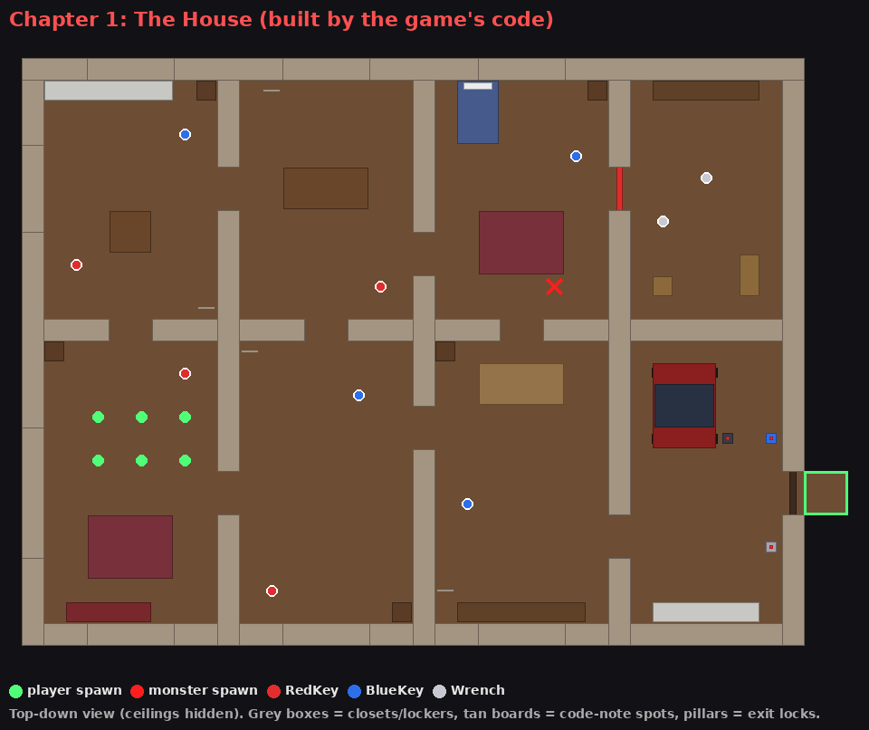
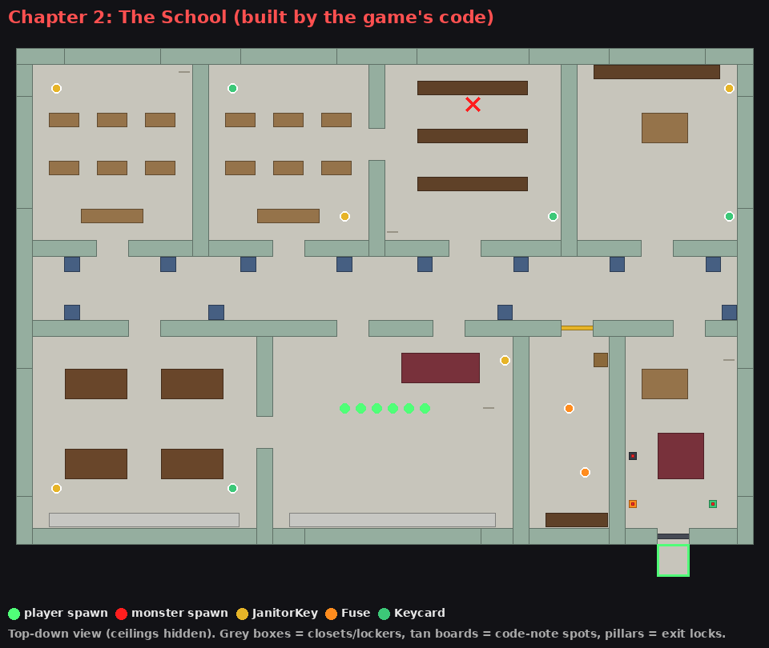
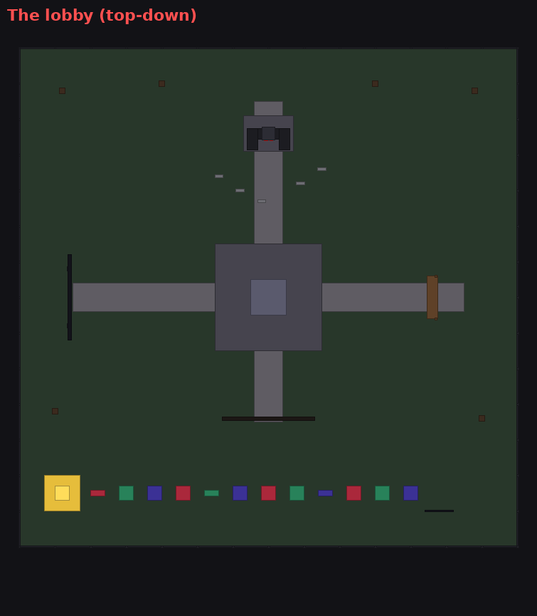

# Escape Glitchy (Roblox game kit)

A chapter-style escape horror game for Roblox, in the same genre as Piggy,
Guesty and Bakon, with its own original monster: **Glitchy**, a corrupted
old-school avatar with glowing eyes. Everything here is original. No names,
characters, maps, art or sounds are taken from those games.

## What's in it

- **Two chapters:** *The House* and *The School*. Items spawn in a random
  spot every round, and each chapter has its own chain of puzzles.
- **Voting:** during intermission everyone votes for the next chapter and for
  an AI or player monster.
- **The monster:** the AI wanders, **sees** you, **hears** you through walls
  when you're close, chases you with pathfinding and searches where it last
  saw you. In **Player mode**, a random player becomes Glitchy.
- **Items and locks:** you hold one item at a time and can swap or drop it.
  There are locked doors, **keypads** (the code is on a note somewhere in the
  map, and it changes every round) and an exit with three locks.
- **Traps:** a player monster can set 3 per round, and the bot drops one now
  and then. Stepping in one holds you for a few seconds and tells the monster
  where you are.
- **Hiding:** get into closets and lockers. The bot can't find you unless it
  watched you get in, a player monster can search hiding spots, and you can't
  stay in forever.
- **Spectating:** watch the players who are still in the round after you're
  caught.
- **Scares:** a jumpscare when you're caught, and a red glow at the edge of the
  screen when Glitchy is near.
- **A real lobby:** a spooky courtyard at night with a giant Glitchy statue, an
  **obby** that pays coins, a live **leaderboard**, a **skin shop** stall and
  a how-to-play board.
- **Skin shop:** survivor and monster skins, bought with coins. Any skin can
  also be sold for Robux.
- **Saving:** coins, escapes and skins are saved.
- **Every device:** works on PC, phone, tablet and console.

| The School | The lobby |
|---|---|
|  |  |

*(These pictures are drawn from what the game's code builds, seen from above
with the ceilings removed.)*

## Quick start (easiest)

1. Install [Roblox Studio](https://create.roblox.com/) and log in.
2. Download **`EscapeGlitchy.rbxl`** from this folder and double-click it (or
   use **File → Open from File** in Studio).
3. Press **Play** (F5).

The lobby and the chapters are built by the scripts when the game starts, so
Workspace looks empty until you press Play. That's normal. To try Player mode
and voting with more people, use **Test → Clients and Servers** in Studio.

## Put the scripts in your own place instead

Create these in the Explorer with **exactly** these names, and paste in the
code from the matching file (all paths are inside `src/`):

| Create this | Named | Inside | Code from |
|---|---|---|---|
| ModuleScript | `Config` | ReplicatedStorage | `ReplicatedStorage/Config.luau` |
| Script | `GameServer` | ServerScriptService | `ServerScriptService/GameServer/init.server.luau` |
| ModuleScript × 11 | `Build`, `Chapters`, `Data`, `Hiding`, `Items`, `Lobby`, `MapBuilder`, `Monster`, `Skins`, `Traps`, `Voting` | the `GameServer` script | `ServerScriptService/GameServer/<name>.luau` |
| LocalScript | `GameClient` | StarterPlayer → StarterPlayerScripts | `StarterPlayer/StarterPlayerScripts/GameClient/init.client.luau` |
| ModuleScript × 6 | `UI`, `Shop`, `Vote`, `Keypad`, `Spectate`, `Actions` | the `GameClient` LocalScript | `StarterPlayer/StarterPlayerScripts/GameClient/<name>.luau` |

If your place has a SpawnLocation, as the Baseplate template does, the script
turns it off so everyone starts in the lobby.

**Rojo users:** `rojo serve` (or `rojo build -o EscapeGlitchy.rbxl`) works
with the included `default.project.json`.

## How to play

| Do this | PC | Phone / tablet | Gamepad |
|---|---|---|---|
| Pick up / use / hide | **E** at the prompt | tap the prompt | the prompt button |
| Drop your item | **G** | **Drop** button | **Y** |
| Enter a code | type it, then **Enter** | tap the number pad | tap the number pad |
| Set a trap (player monster) | **F** | **SET TRAP** button | **X** |
| Open the shop | **SHOP** button, or the shop stall in the lobby | same | same |
| Watch others after you're out | **SPECTATE** button | same | same |

**The House:** the **Red Key** opens the storage room, where the **Wrench** is.
The exit in the garage has three locks: the **Blue Padlock** (Blue Key),
the **Rusty Bolts** (Wrench) and a **Keypad** (the code is on one of the note
boards around the house).

**The School:** the **Janitor Key** opens the janitor's closet, where the
**Fuse** is. The front doors need the **Fuse Box** (Fuse), the **Card
Reader** (Keycard) and the **Keypad** (the code is on a notice board
somewhere).

## Change the game

Almost everything is in **`Config`**:
- **Round:** round times and the monster mode used when nobody votes.
- **Monster:** its speed, what it can see and hear, and its colors.
- **Traps and hiding:** traps per round, how long a trap holds you, how often
  the bot drops one, and how long you can hide.
- **Voting:** turn it on or off.
- **Lobby:** the night lighting, and the obby's coin reward and cooldown.
- **Scares, rewards, items and skins.**

## The skin shop

You earn coins for playing (5), escaping (50), beating the lobby obby (10,
once every 5 minutes) and, as the monster, for each catch (20). Spend them in
the shop:

| Survivor skins | Price | | Monster skins | Price |
|---|---|---|---|---|
| Your Avatar | free | | Glitchy | free |
| Classic Noob | 50 | | Toxic | 200 |
| Midnight (glowing outline) | 150 | | Frostbite | 350 |
| Ghost (see-through) | 300 | | Inferno | 600 |
| Golden (metal) | 750 | | | |
| Galaxy (neon, Robux-ready) | 2000 | | | |

- **Survivor skins** show right away in the lobby, and on your next spawn if
  you're in a round.
- **Monster skins** are what you look like when you're the monster in Player
  mode. `Config.BotSkin` sets the AI monster's skin.
- **Add your own skins** by adding an entry to `Config.Skins`. You can set
  colors, a material, how see-through it is or a glowing outline.
- **Sell a skin for Robux:** publish the game, create a Game Pass (Creator
  Dashboard → your game → Monetization → Passes) and put its id in that skin's
  `GamePassId`. A **Buy with Robux** button appears on its card. `Galaxy` is
  set up as an example.

## Edit the chapters

Each chapter is drawn as a **text grid** in
`ServerScriptService/GameServer/Chapters.luau`. Every character is one 4×4
stud tile, so you can move walls, doors, furniture, items and spawns by
editing the text. The legend is at the top of that file:

- **Basics:** `#` wall, `=` window, `.` floor, `:` doorway.
- **Spawns and markers:** `P` player spawn, `M` monster spawn, `w` spot the
  bot walks to, `n` code-note spot.
- **Hiding and exit:** `h` closet or locker, `G` exit gate, `E` exit.
- **Furniture, items and locks:** a letter for each type of furniture, digits
  for item spots, and capital letters for locks.

After editing, you can run `python3 tools/check_maps.py`. It tries every
combination of random item and code spots and tells you if a chapter can't be
escaped, if a doorway is too narrow, or if an item behind a locked door can be
reached through a wall.

To add a third chapter, copy one of the entries in `Chapters.List` and draw a
new grid.

## Make your own chapter by hand

You can also build a map yourself in Studio. Put it in **ServerStorage →
Maps** as a **Model**. Once there is at least one map there, the built-in
chapters aren't used. Your map needs these things inside it:

| Name | What it is |
|---|---|
| `PlayerSpawns` | Folder of parts where survivors start |
| `MonsterSpawn` | A part where the monster starts |
| `ItemSpawns` | Folder of parts. Give each one an attribute `Item` (string) set to an item id from `Config.Items`, for example `RedKey`. Put several with the same id, and one is picked at random each round. |
| `Locks` | Folder of parts or models. Give each one either an attribute `RequiredItem` (string, an item id) or `Code` (boolean, ticked) for a keypad. Add `ExitLock` (boolean) to the ones that must be opened to escape. A lock disappears when opened, unless it has `KeepOnUnlock` (boolean). Then a part inside it named `Light` turns green instead. |
| `CodeNotes` | Folder of parts (or models with a PrimaryPart). Each round, the keypad code is written on the front and back of one of them. |
| `HidingSpots` | Folder of models. Each needs a part named `Inside`, set as its PrimaryPart, where the hider stands facing out. |
| `ExitGate` | Any part with this name is removed when every exit lock is open. |
| `Exit` | A non-collidable part behind the gate. Players touch it to escape. |
| `Waypoints` | Optional folder of parts the bot walks between |

Give the map Model a `DisplayName` attribute (e.g. "Chapter 3: The Hospital").
Make doorways at least 8 studs wide so the bot can get through. Don't put
SpawnLocations inside maps.

**Tip:** to start from a built-in chapter, press Play, switch to the
**Server** view, copy it from **ServerStorage → Maps**, stop the game and
paste it back into ServerStorage → Maps.

You can also swap in your own models:
- **Monster:** a Model named `MonsterModel` in ServerStorage, with a
  `Humanoid` and a `HumanoidRootPart`.
- **Items:** a Model or Part named after the item id (e.g. `RedKey`), in a
  Folder called `ItemModels` in ServerStorage.
- **Lobby:** a Model named `Lobby` in Workspace. Name parts in it
  `ShopCounter`, `ObbyFinish` or `Leaderboard` to get those features.

## Saving progress

Saving uses DataStores. It works automatically in a published game. To test it
in Studio, open **Game Settings → Security** and turn on **Enable Studio
Access to API Services**. Without that, everything still works, but coins and
skins reset every time.

## Publishing, and making Robux

1. **File → Publish to Roblox**, then make the game public on the Creator
   Dashboard.
2. Fill in the **Maturity & Compliance questionnaire**. Jumpscares and horror
   can affect your game's content label.
3. The skin shop can already sell skins for Robux (see **The skin shop**).
   Games like this also sell **game passes** (e.g. a coin bonus) and
   **developer products** (e.g. a revive) with `MarketplaceService`.
4. Turning Robux into real money goes through Roblox's **DevEx** program,
   which has an age requirement and a minimum amount. Check Roblox's DevEx page
   for the current rules.

Keep it original. Make your own monster, chapters and story. Glitchy is just
a starting point, so rename and restyle it in `Config`.

## Ideas for what to add next

- More chapters, and a story told between them
- Chase music and footstep sounds (you'll need to pick your own sound ids)
- Difficulty settings (the monster's speed and senses are already in `Config`)
- An "infection" mode where caught players become monsters
- Badges for escaping each chapter

## How this was checked

- **Code:** all scripts were type-checked with [luau-lsp](https://github.com/JohnnyMorganz/luau-lsp)
  against the full Roblox API and linted with [selene](https://github.com/Kampfkarren/selene).
  The place file is built with [Rojo](https://rojo.space/).
- **Chapter grids:** checked with `tools/check_maps.py`, which tries every
  item and code combination (128 for the House, 160 for the School).
- **Running the code:** the chapter, lobby, item, keypad, hiding, trap and
  voting setup code was run outside Roblox with stand-ins for the Roblox API,
  to catch runtime errors and count what gets built.
- **Not yet play-tested in Roblox Studio.** If something doesn't work, check
  the **Output** window: every message from this game starts with
  `[Escape Glitchy]`.
