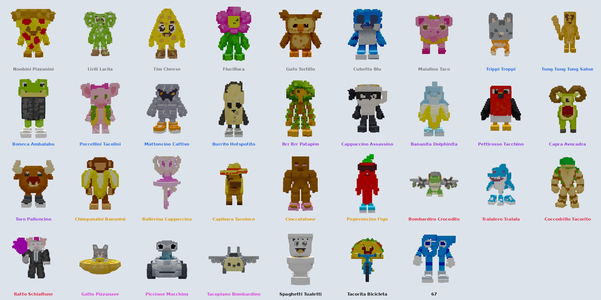

# Steal a Brainrot

A playable Roblox game: buy brainrots from the conveyor, watch them walk home (other players can buy them off you on the way), collect the Cash they earn from the pads in your base (even while you're offline), steal other players' brainrots, lock your base with a laser door, and troll thieves with freeze rays, spike traps, land mines and Boogie Bombs.



## Open it in Studio

Double-click `StealABrainrot-TestPlace.rbxlx`, or open Roblox Studio and use File → Open from File. The map is visible straight away: a studded red-carpet conveyor between two tunnels, 8 well-spaced 4-storey bases (neon trim, real see-through glass windows on every floor, a flag on the roof, stairs up to every floor and green collect pads), long carpets from the conveyor to each base, the Robux Shop (run by a rat in a suit with a galaxy slap glove) and Gear Shop stalls, the global leaderboards, trees, bushes, rocks and street lamps, and a dirt-and-grass border.

Press **Play** (or **Test → Start** with 2 players to try stealing).

## How to play

| Action | How |
|---|---|
| Buy a brainrot | Walk up to one on the conveyor and press **E**. It walks to your base, and until it's through your door **anyone can buy it off you** for the same price (you get your Cash back) |
| Buy someone else's | Catch a brainrot walking to another base and press **E** to buy it; it turns around and walks to yours |
| Earn Cash | Each brainrot fills the green pad in front of it with Cash every second. **Step on the pad to collect it** |
| Offline cash | Brainrots keep earning while you're away (up to 8 hours). When you come back it's waiting on your pads, marked "OFFLINE CASH" |
| Steal | Hold **E** on someone else's brainrot, then run it back into your base. If you die, take too long, or the owner catches you, it goes back |
| Sell | Press **F** on your own brainrot for half its price |
| Lock your base | Step on the red pad inside your base. Lasers zap intruders for 60 seconds |
| Floors | Each base has 4 floors of 8 pedestals. Floor 1 is open from the start; each rebirth opens the next floor (floor 4 at Rebirth 3). New brainrots walk up the stairs to their pedestal |
| Shop | **Shop** button or the Robux Shop stall: Cash bundles, EMP Laser Overrider (walk through lasers for 30s), Server Rarity Boost (x2 rare spawns for 15 min) and the troll items (below) |
| Rebirth | **Rebirth** button: resets Cash (and the pads) for +50% income per rebirth and opens the next floor of your base; you keep your brainrots |
| Index | **Index** button: every brainrot with a spinning 3D preview, its stats, and how many you own |
| Gear Shop | The Gear Shop stall: gear bought with Cash and kept forever (see below) |
| Leaderboards | Top Cash, Top Steals and Top Rebirths across all servers on the boards between the bases; Cash, Steals and Rebirths in the player list |
| Music | The **MUSIC** button (bottom right) turns the music on and off |

The HUD buttons are chunky and bright like the original's (a glossy colour block with a thick black outline, a 3D shadow and the icon popping out of the top); they bounce when you hover them, squish when you click, and their icons wiggle. The Shop button has a pulsing NEW! badge.

New players get a free Noobini Pizzanini so income starts right away.

### Gear

| Gear | Price | What it does |
|---|---|---|
| Slap | Free | A giant purple slap glove on a stick. Knocks players back; a slapped thief drops the brainrot they're carrying |
| Speed Coil | $7.5K | Run much faster while holding it |
| Gravity Coil | $20K | Jump three times higher while holding it |
| Invisibility Cloak | $100K | Click to turn invisible for 8 seconds (30 s recharge). Grabbing a brainrot reveals you |

Coils don't work while you carry a stolen brainrot, so thieves stay catchable.

### Troll items (Robux Shop)

Bought with Robux like the original game's trolling gear. Each purchase gives a few charges, which are saved; the item shows up in your backpack as a tool (for example "Freeze Ray x3") until they're used up. Every one of them makes a thief drop the brainrot they're carrying.

| Item | Charges | What it does |
|---|---|---|
| Freeze Ray | 3 | Freezes the player you're facing (up to 45 studs) in a block of ice for 4 seconds. Missing costs no charge |
| Spike Trap | 3 | Put down in front of you. Whoever steps on it is stuck for 3 seconds ("OUCH!") |
| Land Mine | 3 | Hidden mine with a blinking light. Whoever steps on it is launched sky high with an explosion (no damage) |
| Boogie Bomb | 2 | A disco ball drops and everyone within 22 studs dances for 4 seconds and can't move |

Up to 3 traps and mines each stay out for 2 minutes; your own never go off on you. A banner shows the victim what happened ("FROZEN SOLID!", "YOU CAN'T STOP DANCING!", ...).

### Events

Every 5 to 8 minutes an event runs for 3 minutes, with its own sky colour, things falling from the sky and a timer at the top of the screen:

| Event | What happens |
|---|---|
| Gold Rush / Diamond Storm / Rainbow Party | Gold x5, Diamond x6 or Rainbow x10 as common; gold sparkles, diamonds or confetti fall |
| Blood Moon | It turns to midnight under a red sky with rising embers; brainrots can spawn **Bloodrot** (x3) |
| Galaxy Night | Midnight under a purple sky full of stars; brainrots can spawn **Galaxy** (x4) |
| Lava Rain | Meteors fly across an orange sky; brainrots can spawn **Lava** (x3.5) |
| Frost Storm | Snow under an icy sky; brainrots can spawn **Frozen** (x2.5) |
| Taco Tuesday | Tacos rain down and Taco brainrots are 8x more common |
| Lucky Hour | Clovers fall and every rarity above Common is 3x more likely |
| Cash Rain | Coins drop all over the map; grab one for 20 seconds of your income (at least $150) |

### Day, night and weather

A full day passes every 10 minutes (the night is shorter), and the street lamps and base lamps come on at night. Every 3 to 5 minutes the weather changes between clear skies, **rain**, **snow**, **fog** and **thunderstorms** with lightning bolts and thunder. Rain and snow stay out of the bases.

### Rarities, mutations and spawn timers

- **34 brainrots** in 7 rarities: Common, Rare, Epic, Legendary, Mythic, **Brainrot God** (rainbow name and glow) and **Secret** (black name with a white outline, dark smoke and white sparks) — from Noobini Pizzanini up to Tralalero Tralala, Ratto Schiaffone, Gatto Pizzanave, Tacorita Bicicleta and the Secret **67**. Rarer brainrots glow in their rarity colour, sparkle and have a rising aura; Mythic and up pulse.
- **Mutations**, rolled when a brainrot spawns: **Gold** (6%, x1.5 income and price), **Diamond** (2.5%, x2) and **Rainbow** (0.6%, x5), plus the event-only **Bloodrot** (x3), **Galaxy** (x4), **Lava** (x3.5, on fire) and **Frozen** (x2.5). Mutated brainrots are recoloured, shine and sparkle in their colour; Rainbow cycles through every colour. Mutations are saved with the brainrot.
- **Guaranteed spawns**: the sign over the spawn tunnel counts down to a guaranteed Legendary (every 4 minutes), Mythic (10 minutes), Brainrot God (20 minutes) and Secret (45 minutes).

Walking brainrots know the height of every point on their way (the ground, each flight of stairs, each floor and the pedestal), so even a laggy moment can't knock one off the stairs or send it the wrong way.

Brainrots really move: each blocky model is split into a body and its legs, and walkers swing their legs in turn (with the body bobbing and leaning) at a pace that matches how fast they move, on the conveyor, on the way home and up the stairs. Planes and flying brainrots (Bombardiro Crocodilo, Gatto Pizzanave, Tacoplano Bombardino) hover and bank, vehicles (Piccione Macchina, Tacorita Bicicleta) roll along with little bumps, the Ballerina pirouettes, and Toro Palloncino and Spaghetti Tualetti hop. They bob and sway while idle and wriggle while being carried.

The two shopkeepers are animated: the Robux rat winds up and slaps with its galaxy glove, the Gear Shop noob waves, both look around and talk in speech bubbles.

## Music and sound effects

The game plays a looping playlist of licensed production music (APM) and sound effects for buying, collecting, selling, stealing (an alarm when someone grabs yours), getting a brainrot back, being bought out, the laser zap, locking, rebirthing, slapping, the cloak, events and every button. All of them are audio from Roblox's Creator Store that any experience may use; most of the effects are Roblox's own. The IDs are in `ReplicatedStorage/Shared/AudioConfig.luau`: to use your own music or sounds, upload them in the Creator Dashboard and put their IDs there. If a sound can't load on a player's device, a built-in Roblox sound plays instead; a music track that can't load is skipped.

(Higgsfield's tools could not be used for audio here: its only general audio tool makes speech, and its music and sound-effect models are reserved for its game-generation pipeline.)

## 3D models and icons

All 34 brainrots were made from blocky concept art (GPT Image 2.5 on Higgsfield, using the Roblox-style reference line-up) turned into 3D, then into blocky models like the original game: each model is cut into blocks 40 tall, every block takes the colour most of the model's texture under it has (so eyes, ties and glasses stay crisp), stray speckles are cleaned up, and same-coloured faces are merged.

- **Customuse** (CR1 3D + Meshy texture from the same concept art) made the models whose details got lost the first time: Ratto Schiaffone (with his purple galaxy slap glove), Tung Tung Tung Sahur (with his bat), Tim Cheese, Lirili Larila, Bombardiro Crocodilo, Trippi Troppi and Tralalero Tralala. The workflow is at https://customuse.com/workflow/02c37c8d-d0cb-430c-a948-816aad2d7f7c.
- **Higgsfield** (SAM 3 3D) made the other 27.

The Index, Rebirth and Shop buttons, the shop cards (including the four troll items) and the boost timers use icons made with Higgsfield too.

Nothing has to be uploaded to Roblox first: the models and icons are stored as compressed data in `ReplicatedStorage.Assets`, and each player's game rebuilds them with Roblox's EditableMesh and EditableImage. Every model is built **once**, in the background a few milliseconds per frame (so the game never stutters), starting with the brainrots already in the world; every brainrot after that is an instant copy. A model someone is waiting to see jumps the queue. If a model can't be built (for example, the device is out of memory), that brainrot shows a simple block figure and the game tries again a few seconds later; the Output window shows an `[AssetLoader]` warning with the reason. **When you publish**, turn on Game Settings → Security → **Allow Mesh / Image APIs** so players' games are allowed to build the models.

To use normal uploaded meshes instead, import the models from `BrainrotModels/Blocky/` (blocky, vertex colours) or `BrainrotModels/` (smooth, textured) with File → Import 3D, and put each Model in a `ReplicatedStorage.BrainrotModels` folder named after its Id (for example `TralaleroTralala`). The game scales it to the right size.

## Saving and purchases

An unpublished place can't use DataStores or sell products, so in Studio you get fresh data every time and the shop's buy buttons show an error. To test saving and real purchases:

1. Publish the place (File → Publish to Roblox).
2. Turn on Game Settings → Security → **Enable Studio Access to API Services**.
3. Create the eight developer products in the Creator Dashboard (Cash bundles, EMP Laser Overrider, Server Rarity Boost, Freeze Ray, Spike Trap, Land Mine and Boogie Bomb), upload the icons from `ProductIcons/`, and put the real IDs in `ReplicatedStorage/Shared/MonetizationConfig.luau`. Do the same for the game passes (VIP, DoubleCash).

Global leaderboards also need a published place with API access; until then the boards rank the players in the current server.

## Files

| Path | What it is |
|---|---|
| `ServerScriptService/DataAndMonetizationManager.server.luau` | Player data (Cash, Steals, Rebirths, game passes, brainrots, gear, troll item charges, pad Cash, offline time), leaderstats and all Robux purchases |
| `ServerScriptService/GameplayManager.server.luau` | Bases and their floors, conveyor, walking home (up the stairs) and buying brainrots off other players, collect pads and offline cash, mutations and events (including Cash Rain), spawn timers, stealing, lasers, rebirths |
| `ServerScriptService/GearManager.server.luau` | Gear Shop, the slap glove, coils and cloak, and the troll items (Freeze Ray, Spike Trap, Land Mine, Boogie Bomb) |
| `ServerScriptService/WorldManager.server.luau` | Day and night, street lamps and the weather |
| `ServerScriptService/LeaderboardManager.server.luau` | Global leaderboards and the logo board |
| `StarterPlayerScripts/GameClient.client.luau` | HUD, Robux Shop, Gear Shop, rebirth screen, Index, pop-up messages, music button, clouds |
| `StarterPlayerScripts/BrainrotVisuals.client.luau` | Blocky 3D models, rarity and mutation effects, walking, flying, driving, spinning and hopping |
| `StarterPlayerScripts/WorldEffects.client.luau` | Weather, event skies and falling particles, lightning, animated shopkeepers, Cash Rain coins, the troll item banner |
| `ReplicatedStorage/Shared/AssetLoader.luau` | Rebuilds the blocky models (body and legs) and icons from `ReplicatedStorage/Assets` |
| `ReplicatedStorage/Shared/Sounds.luau` | Plays the music and sound effects on each player's game |
| `ReplicatedStorage/Shared/AudioConfig.luau` | Music playlist and sound effect IDs |
| `ReplicatedStorage/Shared/GearConfig.luau` | Gear prices, descriptions and tuning, and the troll items |
| `ReplicatedStorage/Assets/` | Packed models and icons, generated by `tools/build_assets.py` |
| `BrainrotModels/` | Smooth models (`.glb`), blocky models (`Blocky/*.glb`) and `preview.png` |
| `ReplicatedStorage/Shared/BrainrotConfig.luau` | Every brainrot, rarity and mutation: prices, income, colours, spawn chances |
| `ReplicatedStorage/Shared/GameConfig.luau` | Gameplay tuning: conveyor and walking speed, spawn timers, floors, lock time, offline cash, events, day length, weather, rebirth cost, ... |
| `ReplicatedStorage/Shared/MonetizationConfig.luau` | Product and game pass IDs and shop text |
| `ReplicatedStorage/Shared/NumberFormat.luau` | `$1.2K`-style number formatting |
| `Workspace/Map.model.json` | The map, generated by `tools/generate_map.py` |
| `ProductIcons/` | 1024×1024 icons for the eight developer products (made with Higgsfield) |
| `UIIcons/` | Index, Rebirth and Shop button icons (made with Higgsfield) |
| `StealABrainrot-TestPlace.rbxlx` | The built place |
| `default.project.json` | [Rojo](https://rojo.space) project that builds the place |

## Rebuilding

After editing scripts or the map generator, rebuild the place with Rojo 7:

```sh
python3 tools/generate_map.py
rojo build default.project.json -o StealABrainrot-TestPlace.rbxlx
```

After changing a model or icon, repack the assets first (needs `pip install numpy scipy pillow trimesh pymeshlab zstandard`). To swap in a new model, put the raw `.glb` in `BrainrotModels/source/<Id>.glb`; the script simplifies it, turns it to face Roblox's front, overwrites `BrainrotModels/<Id>.glb` and builds the blocky version:

```sh
python3 tools/build_assets.py              # every model and icon
python3 tools/build_assets.py TimCheese    # just these models
```

The script also finds each model's legs (the separate block groups that stand on the ground, up to where they join the body) so the game can swing them.

Or run `rojo serve` and connect the Rojo Studio plugin to sync changes live.
