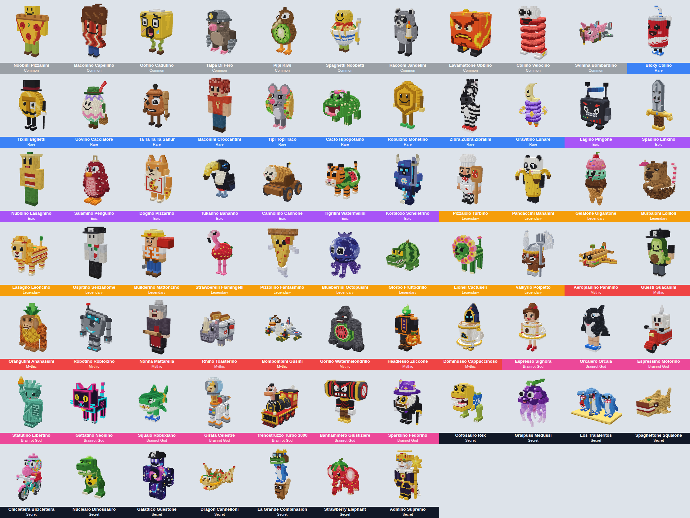
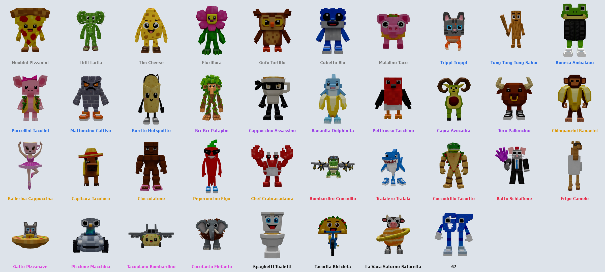

# Steal a Brainrot

A playable Roblox game: buy brainrots and lucky blocks from the conveyor, watch them walk home (other players can buy them off you on the way), collect the Cash they earn from the pads in your base (even while you're offline), steal other players' brainrots (your base sounds the alarm), lock your base with a laser door, troll thieves with freeze rays, spike traps, land mines and Boogie Bombs, trade and fuse brainrots, fill the Index, spin the wheel, do daily quests and survive ADMIN ABUSE.

On top of the original game: brainrots **level up** and wear **hats**, one can **guard** the front of your base and up to six can follow you as **pets**, **revenge** and **bounties**, **crews**, a 30-tier **season pass**, a **weekly limited brainrot**, **Boss Raids** and **Bank Heists**.

113 brainrots: 37 made from 3D models, and 76 built from blocks (including a remade Noobini Pizzanini, the Roblox-guest **Guesti Guacanini**, **Benjini Skatini** (Benji on his skateboard), his dog **Canelito Cannolito** and **Greggini Ricciolini** (Greg), on skateboards too, more of the original Italian brainrots, 30 new Roblox-themed ones and the 7 XRE mobs: Nonna Mattarella, Baconini Croccantini, Ospitino Senzanome, Nubbino Lasagnino, Pizzolino Fantasmino, Espressino Motorino and Spaghettone Squalone):





## Open it in Studio

Double-click `StealABrainrot-TestPlace.rbxlx`, or open Roblox Studio and use File → Open from File. The map is visible straight away, as big as the original's (840 by 460 studs): a studded red-carpet conveyor between two tunnels, 8 well-spaced 4-storey bases (neon trim, real see-through glass windows on every floor, a flag on the roof, stairs up to every floor and green collect pads), long carpets from the conveyor to each base, the Robux Shop (run by a rat in a suit with a galaxy slap glove), the Gear Shop and the gold Limited Shop stalls, the glowing Fuse Machine, two fountains, the **Hall of Fame** (Top Cash, Top Steals, Top Earners and Top Rebirths boards around a statue of the top thief), the **bank vault** that opens for Bank Heists, trees, bushes, rocks and street lamps, and a dirt-and-grass border.

Every sign, label and name tag is sized like a real sign in the world: normal size up close and smaller far away, never giant from across the map.

Press **Play** (or **Test → Start** with 2 players to try stealing).

## Import the brainrot models (once, about a minute)

Every brainrot's model is in one file, `BrainrotModels/Import/BrainrotModels.glb`: the 37 made with Higgsfield and Customuse and all 76 built from blocks (each block-built one split into its moving pieces, with markers at the joints). Roblox only shows real meshes after they're uploaded to your account, and Studio does that for you when you import:

1. If you imported an older version of the file, delete that model first (the game ignores old block-built ones like the old Noobini Pizzanini anyway).
2. In Studio: **File → Import 3D** (or the Avatar tab → Import 3D) and pick `BrainrotModels.glb`.
3. Press **Import**. A model with all 113 brainrots appears in the Workspace (you can move it into ReplicatedStorage, but you don't have to).
4. **File → Save** so the place keeps it.

That's it: the game finds the models by their part names (`TimCheese_Body`, `TimCheese_Leg1`, `NoobiniPizzanini_Arm3`, ...), stands each one up facing the right way, and uses them for every brainrot, with its own animation: legs that walk, arms that swing, wings that flap, tails that wag, heads that nod, ears that flop, propellers and wheels that spin, flying, driving, skateboarding and hopping, bobbing when idle and wriggling when carried. They load like any Roblox mesh. Tip: right-click the imported model → **Save to File** to keep a `.rbxm` you can drop into any newer version of the place instead of importing again.

Until you import the file, each player's game builds blocky versions of the models itself (slower, and it needs Game Settings → Security → **Allow Mesh / Image APIs** once published). Where that isn't allowed either, it builds them out of ordinary Parts (`ReplicatedStorage/Assets/BrainrotBoxes/`), so a brainrot is never invisible. The Output says which one the game is using.

**A model missing?** When you press Play, the Output lists every brainrot that has no imported model (for example `La Vaca Saturno Saturnita (One/LaVacaSaturnoSaturnita.glb)`). Each brainrot also has its own file in `BrainrotModels/Import/One/`: import just that file (File → Import 3D), save, and play again. The game finds imported models anywhere in the Workspace, ReplicatedStorage or ServerStorage, even inside folders.

## How to play

When you join, a title screen comes up over a slow, blurry flyover of the map: the bouncing, cartoon **STEAL A BRAINROT** logo, a loading bar with tips, and a **SKIP** button. Once everything has loaded, the bar fills and a big **PLAY!** button pops up; press it (or SKIP at any time) and the blur clears and the camera drops back to your character.

| Action | How |
|---|---|
| Buy a brainrot | Walk up to one on the conveyor and press **E**. It walks to your base, and until it's through your door **anyone can buy it off you** for the same price (you get your Cash back) |
| Buy someone else's | Catch a brainrot walking to another base and press **E** to buy it; it turns around and walks to yours |
| Earn Cash | Each brainrot fills the green pad in front of it with Cash every second. **Step on the pad to collect it** |
| Offline cash | Brainrots keep earning while you're away (up to 8 hours). When you come back it's waiting on your pads, marked "OFFLINE CASH" |
| Steal | Hold **E** on someone else's brainrot, then run it back into your base. If you die, take too long, or the owner catches you, it goes back. The owner's screen flashes red with a siren and a line pointing at you, and their base lights flash red |
| Sell | Press **F** on your own brainrot for half its price |
| Upgrade a pedestal | Press **R** on your own brainrot: each level (up to 5) adds +25% to whatever stands on that pedestal, and the pedestal gets a glowing ring |
| Manage a brainrot | Press **G** on your own brainrot: its level, its hat, and the Make Guard and pet buttons |
| Levels | Brainrots level up while they stand on a pedestal: level 2 after 5 minutes, up to level 10 after 6 hours. Each level adds +10% income and shows on its sign ("⭐ Lv 3"). A stolen brainrot starts again at level 1; a traded one keeps its level |
| Hats | 8 hats, from the Party Hat (+5% income) to the Crown (+25%), from the Hat Crate, the season pass and Boss Raids. Put one on from the Manage menu and it sits on the brainrot's head. If the brainrot is stolen, sold, fused or traded, the hat comes back to you |
| Guard | Make one brainrot your guard: it stands just outside your door and walks up and down in front of it. When someone else comes within 14 studs, a "❗" pops up over it for a moment (your warning to dodge), then it charges and knocks them back; a thief it catches drops the brainrot. Then it rests for 12 to 24 seconds (rarer is faster; half as long with the Super Guard pass). It's fair to thieves: it never leaves the front of your base, it can't see cloaked players, it's slower than a running player, and a slap knocks it out for 6 seconds. Your crew can walk past it. It keeps earning |
| Pets | The **Pets** button (🐾, on the right) opens your pets: pick which brainrots follow you around as small copies. You start with 1 pet slot; more cost $1M, $25M, $500M, $10B and $100B (6 at most). Each pet makes you faster: the best one gives its full bonus (+1 for a Common up to +4 for a Secret) and every other one a quarter of its bonus, up to +8 in all. Your guard can't be a pet |
| Revenge | When someone steals from you, you're faster (+6) for 60 seconds and a beam points at them. Steal anything back from them in time for a bonus of 2 minutes of your income (at least $500) |
| Bounty | The server's top thief (3 or more steals) gets a 💰 bounty on their name tag: $1K plus 20 seconds of their income per steal. Steal from them to claim it |
| Lucky blocks | They turn up on the conveyor now and then (or come from the Robux Shop, the wheel, quests and gifts). Take it home and hold **E** on it: it shakes, a roulette spins and it pops into a random brainrot |
| Lock your base | Step on the red pad inside your base. Lasers zap intruders for 60 seconds (2 minutes with the Long Lock pass) |
| Floors | Each base has 4 floors of 8 pedestals. Floor 1 is open from the start; each rebirth opens the next floor (floor 4 at Rebirth 3). New brainrots walk up the stairs to their pedestal |
| Shop | **Shop** button or the Robux Shop stall: the game passes, Cash bundles, EMP Laser Overrider (walk through lasers for 30s), Server Rarity Boost (x2 rare spawns for 15 min), the Hat Crate and the troll items (below) |
| Rebirth | **Rebirth** button: resets Cash (and the pads) for +50% income per rebirth and opens the next floor of your base. Each rebirth also needs certain brainrots in your base (rebirth 1: Tung Tung Tung Sahur and Trippi Troppi, then rarer ones); you keep them and all your other brainrots |
| Index | **Index** button: a big book of every brainrot, six to a row (scroll down for more), each with a spinning 3D preview; ones you've never had are black silhouettes named "???". Pages for Gold, Diamond and Rainbow ones too. Finishing a page pays out once and adds income forever (see below). Limited and season brainrots are marked and don't count towards finishing a page |
| Spin | **Spin** button: one free spin of the prize wheel a day (+1 with Premium, +1 with VIP), more from spin packs, quests, gifts and codes |
| Quests | **Quests** button: three daily quests (buy 5 brainrots, steal 2, open a lucky block, slap 5 players, ...) and a Mythic Lucky Block for finishing all three |
| Gifts | **Gifts** button: the 7-day login streak (a better reward each day, up to a Brainrot God Lucky Block), playtime gifts that unlock after 3 to 60 minutes played today, codes, and the Group Chest |
| Trade | **Trade** button: pick a player; each of you puts up to 4 brainrots on the table, both press Ready and it swaps after a 5 second countdown (any change un-readies both) |
| Fuse | Walk up to the Fuse Machine (by the tunnel where brainrots come out): put in 3 brainrots of one rarity and get a random one of the next rarity (it keeps the mutation if all 3 share it) |
| Upgrade | **Upgrade** button: walk speed levels (+2 speed each, 10 levels) and base skins |
| Settings | **Settings** button: music and sound volume, low graphics (no weather or sparkles), skip the tutorial |
| Gear Shop | The Gear Shop stall: gear bought with Cash and kept forever (see below) |
| Crews | **Crew** button: start a crew (pick a name and a colour) and invite up to 3 players. Each crewmate in the server adds +5% income, you walk through each other's lasers and can't steal from each other, and the crew's name shows on your name tags |
| Season pass | **Season** button: everything earns XP (buying, stealing, collecting, quests, raids, heists, and 2 XP a minute just for playing), and every 150 XP opens a tier. Each of the 30 tiers has a free reward and a premium one for Season Pass owners: Cash, spins, lucky blocks, boosts, hats, Guesti Guacanini (tier 10), Orcalero Orcala (tier 20) and the season-only **Admino Supremo** (tier 30). A new season starts every 28 days |
| Limited Shop | The gold stall: one limited brainrot a week (Korbloxo Scheletrino, Valkyrio Polpetto, Headlesso Zuccone, Dominusso Cappuccinoso, Sparklino Fedorino), sold for Robux and never on the conveyor. It spins on the stall's display with a countdown to the next one |
| Leaderboards | Top Cash, Top Steals, Top Earners (best income per second) and Top Rebirths across all servers in the Hall of Fame, with the top thief's avatar on a podium; Cash, Steals and Rebirths in the player list |

The HUD buttons are chunky and bright like the original's (a glossy colour block with a thick black outline, a 3D shadow and the icon popping out of the top); they bounce when you hover them, squish when you click, and their icons wiggle. A red **!** shows when something's waiting (a free spin, a daily reward, a finished quest). The Shop button has a pulsing NEW! badge. On small screens (phones) the buttons shrink to fit.

New players get a free Noobini Pizzanini so income starts right away, and a short tutorial with an arrow: buy a brainrot, collect its Cash, lock your base ($1K when you're done).

Your income multiplier shows in the bottom-right corner (above the jump button on phones and tablets); tap it for the list of boosts: rebirths, the 2x Cash pass, a Cash Boost, **+10% for each friend in the server** (up to +50%), **Premium** (+10%), **VIP** (+15%), your **group** (+10%) and the **Index** (up to +100%).

### Gear

| Gear | Price | What it does |
|---|---|---|
| Slap | Free | A giant purple slap glove worn on your hand. Knocks players back; a slapped thief drops the brainrot they're carrying |
| Speed Coil | $7.5K | Run much faster while holding it |
| Gravity Coil | $20K | Jump three times higher while holding it |
| Invisibility Cloak | $100K | Click to turn invisible for 8 seconds (30 s recharge). Grabbing a brainrot reveals you |

Coils don't work while you carry a stolen brainrot, so thieves stay catchable.

### Troll items (Robux Shop)

Bought with Robux like the original game's trolling gear. Each purchase gives a few charges, which are saved; the item shows up in your backpack as a tool (for example "Freeze Ray x3") until they're used up. Every one of them makes a thief drop the brainrot they're carrying.

| Item | Charges | What it does |
|---|---|---|
| Freeze Ray | 3 | Freezes the player you're facing (up to 45 studs) in a block of ice for 4 seconds. Missing costs no charge |
| Spike Trap | 3 | Put down in front of you. Whoever steps on it is stuck for 3 seconds ("OUCH!") |
| Land Mine | 3 | Hidden mine with a blinking light. Whoever steps on it is launched sky high with an explosion (no damage) |
| Boogie Bomb | 2 | A disco ball drops and everyone within 22 studs dances for 4 seconds and can't move |

Up to 3 traps and mines each stay out for 2 minutes; your own never go off on you. A banner shows the victim what happened ("FROZEN SOLID!", "YOU CAN'T STOP DANCING!", ...).

### Events

Every 5 to 8 minutes an event runs for 3 minutes, with its own sky (a huge sun, diamonds, a rainbow, a blood moon, galaxies, a volcano, an aurora, tacos, clovers, coins, an eclipse or searchlights), things falling from the sky and a timer at the top of the screen. Each event has its own brainrot variant that glows in its colour, with neon blocks circling it and particles:

| Event | What happens |
|---|---|
| Gold Rush / Diamond Storm / Rainbow Party | Gold x5, Diamond x6 or Rainbow x10 as common; gold sparkles, diamonds or confetti fall |
| Blood Moon | It turns to midnight under a red sky with rising embers; brainrots can spawn **Bloodrot** (x3) |
| Galaxy Night | Midnight under a purple sky full of stars; brainrots can spawn **Galaxy** (x4) |
| Lava Rain | Meteors fly across an orange sky; brainrots can spawn **Lava** (x3.5) |
| Frost Storm | Snow under an icy sky; brainrots can spawn **Frozen** (x2.5) |
| Taco Tuesday | Tacos rain down, half the brainrots are Taco brainrots, and brainrots can spawn **Taco** (x3) |
| Lucky Hour | Clovers fall, every rarity above Common is 3x more likely, and brainrots can spawn **Lucky** (x2.5) |
| Cash Rain | Coins drop all over the map (grab one for 20 seconds of your income, at least $150), and brainrots can spawn **Cash** (x3) |
| **Boss Raid** | The sky goes dark and a giant brainrot rampages up and down the middle of the map. Every boss is a random tier: 🟢 **Easy** (smaller, weaker, stomps and lasers), 🟡 **Normal** (adds grab-and-throw), 🟠 **Hard** (bigger and tougher, adds meteor rain and a jump slam) or 💀 **Mega** (huge, with every attack, faster). Every attack warns you first so you can dodge: a stomp shockwave, a red aiming line before its **laser beam**, a red ring under you before it **grabs and throws** you, red circles before **meteors** crash down, and the ring where it'll land before it **leaps and slams**. Below 30% health it's **enraged**: it's on fire, moves and attacks faster. Everyone clicks it (or slaps it) to hurt it; a health bar at the top shows its tier. When it falls, the top 3 raiders win lucky blocks: Easy a Mythic and two Lucky Blocks, Normal a Brainrot God and two Mythics, Hard two Brainrot Gods and a Mythic (and a Mythic Lucky Block for everyone else who helped), Mega a **Secret** and two Brainrot Gods (plus a Mythic for every helper). Everyone who helped gets 4 minutes of their income (x1.5 to x3 for tougher bosses, at least $2.5K) and maybe a hat, and the event ends. Brainrots can spawn **Boss** (x5) |
| **Bank Heist** | Searchlights sweep the sky and the vault door rolls open. Each pile says what it holds: 💵 **Cash** (45 seconds of your income, at least $800), 🟨 **Gold Bars** (90 seconds, at least $2K) or rare 💎 **Diamonds** (3 minutes, at least $5K, sparkling on top). Grab a bag (hold E) and carry it into your own base; heavier loot slows you more, and a slap makes you drop it for anyone to grab. Red **security lasers** sweep the vault at ankle and knee height: jump over them or get zapped back and drop your bag. In the last minute the **alarm** goes off: the lights flash faster, the lasers speed up and loot is worth **double**. When it closes, whoever banked the most wins a Mythic Lucky Block. Brainrots can spawn **Heist** (x3.5) |
| **ADMIN ABUSE** | Now and then (1 in 10 events) instead of a normal event: a shaking rainbow banner, every conveyor brainrot gets a mutation (sometimes the glitching **Admin** one, x7), prices are halved, 10x luck, traits 5x likelier and Cash rains |

#### Event commands

Admins can start and stop events by typing in the chat. Admins are you in Studio, the game's owner (for a game owned by a user) and anyone whose user ID is in `FeatureConfig.AdminUserIds` (add yours there for a group-owned game). Anyone else gets "Only admins can use ..." and the Output shows the user ID to add.

Every command answers with a pop-up ("Starting Gold Rush!", "Ended Gold Rush.", ...) and a line in the Output (`[GameplayManager] Alice used /event gold`), so you can tell it arrived.

| Command | What it does |
|---|---|
| `/events` | Lists every event and these commands |
| `/event <name>` | Starts that event now, for the usual 3 minutes. Names aren't case-sensitive and the start of one is enough: `/event gold rush`, `/event diamond`, `/event rainbow`, `/event blood`, `/event galaxy`, `/event lava`, `/event frost`, `/event taco`, `/event lucky`, `/event cash`, `/event boss` (Boss Raid), `/event bank` (Bank Heist), `/event admin` |
| `/abuse` | Starts ADMIN ABUSE |
| `/endevent` | Ends the current event now |

Starting an event while another is running ends that one first. The commands work with Roblox's current chat (TextChatService); the place is set to use it.

### Day, night and weather

A full day passes every 10 minutes (the night is shorter), and the street lamps come on at night. Inside the bases the lights are always on: three ceiling panels over the pedestals on every floor and glowing strips in the base's colour along the walls. Every 3 to 5 minutes the weather changes between clear skies, **rain**, **snow**, **fog** and **thunderstorms** with lightning bolts and thunder, each with its own clouds. In the snow the ground, the roofs and the bushes turn white and the trees frost over, then it all melts when the snow stops; snow can spawn **Frozen** brainrots (x2.5) and thunderstorms **Storm** ones (x4). Rain and snow stay out of the bases.

### Rarities, mutations and spawn timers

- **113 brainrots** in 7 rarities: Common, Rare, Epic, Legendary, Mythic, **Brainrot God** (rainbow name and glow) and **Secret** (black name with a white outline, dark smoke and white sparks) — from Noobini Pizzanini up to Chef Crabracadabra, Frigo Camelo, Tralalero Tralala, Espresso Signora, Orcalero Orcala, Girafa Celestre, Gattatino Neonino, Cocofanto Elefanto, **La Vaca Saturno Saturnita**, Los Tralaleritos, Graipuss Medussi, La Grande Combinasion, Strawberry Elephant, Dragon Cannelloni and the Secret **67**, plus Roblox-themed ones like Guesti Guacanini, Bloxy Colino, Robuxino Monetino, Oofosauro Rex, Banhammero Giustiziere and Galattico Guestone, and the XRE mobs from Baconini Croccantini (Rare) up to Nonna Mattarella (Mythic), Espressino Motorino riding his scooter (Brainrot God) and the Secret Spaghettone Squalone, and three made from real life: **Canelito Cannolito** (Brainrot God), a fluffy puppy with a cannoli in his mouth riding a skateboard, **Benjini Skatini** (Secret), Benji riding his, and **Greggini Ricciolini** (Secret), Greg with his curly hair and white tee, on the same skateboard. Rarer brainrots glow in their rarity colour, sparkle and have a rising aura; Mythic and up pulse. The 5 weekly limited brainrots and Admino Supremo (season pass) are exclusive: they never spawn on the conveyor.
- **Mutations**, rolled when a brainrot spawns: **Gold** (6%, x1.5 income and price), **Diamond** (2.5%, x2) and **Rainbow** (0.6%, x5), plus the event and weather ones: **Bloodrot** (x3), **Galaxy** (x4), **Lava** (x3.5, on fire), **Frozen** (x2.5), **Taco** (x3), **Lucky** (x2.5), **Cash** (x3), **Storm** (x4), **Heist** (x3.5), **Boss** (x5, on fire) and **Admin** (x7, glitching). Mutated brainrots are recoloured, shine and sparkle in their colour, and neon blocks circle them (more for rarer mutations); Rainbow cycles through every colour. Mutations are saved with the brainrot.
- **Traits**, rolled like mutations and stacking with them: **Fire** (3%, x2, burns), **Tiny** (3%, x1.5, small), **Giant** (2%, x3, big), **Glitched** (0.6%, x6, flickers and jumps about) and **Nyan** (0.3%, x8, a rainbow trail). A Fire Gold Tim Cheese earns 1.5 x 2 = 3x.
- **Guaranteed spawns**: the sign over the spawn tunnel counts down to a guaranteed Legendary (every 4 minutes), Mythic (10 minutes), Brainrot God (20 minutes) and Secret (45 minutes).
- **Lucky blocks** (5% of conveyor spawns): Lucky Block ($25K: Rare to Mythic), Mythic Lucky Block ($400K: Legendary to Secret) and Brainrot God Lucky Block ($5M: Mythic to Secret, 5% Secret); the Secret Lucky Block (30% Secret) is Robux only. Lucky blocks hop home, float on their pedestal and can be stolen.

### Index rewards

Finishing a page of the Index pays out once and adds income forever: Common +5% and $5K, Rare +5% and $25K, Epic +10% and $150K, Legendary +10% and $1M, Mythic +15% and $5M, Brainrot God +20% and $25M, Secret +25% and $100M; every Gold brainrot +10% and $2M, every Diamond +15% and $10M, every Rainbow +30% and $50M.

### Codes

`BRAINROT` (Cash), `LUCKY` (a Lucky Block), `SPIN` (2 spins), `TUNGTUNG` (a Tung Tung Tung Sahur) and `RELEASE` (15 minutes of 2x Cash). Each works once per player; add your own in `FeatureConfig.Codes`.

Walking brainrots know the height of every point on their way (the ground, each flight of stairs, each floor and the pedestal), so even a laggy moment can't knock one off the stairs or send it the wrong way.

Brainrots really move: each model is split into a body and its legs (block-built ones also have arms that swing, wings that flap, tails that wag, heads that nod and props that spin), and anything with two legs walks, swinging its legs in turn with a small bob and lean, at a pace that matches how fast it moves, on the conveyor, on the way home and up the stairs. Brainrots without legs waddle, rocking from side to side with each step. Planes and flying brainrots (Bombardiro Crocodilo, Gatto Pizzanave, Tacoplano Bombardino) hover and bank and vehicles (Piccione Macchina, Tacorita Bicicleta) roll along with little bumps. Benjini Skatini and Greggini Ricciolini skate: they carve from side to side with their arms out, kick with their back foot to push, the wheels roll with their speed, and every few seconds they pop a trick (an ollie, a **kickflip** with the board flipping under their feet, or a shove-it), even parked on a pedestal. Canelito Cannolito skates the same way, pushing with one back paw; his floppy ears bounce as he rides and fly up when he jumps, his curly tail wags, and when he's parked he does the puppy head tilt between tricks. When idle they bob and sway (the Ballerina twirls, Toro Palloncino and Spaghetti Tualetti bounce a little), and they wriggle while being carried. A sparkle burst plays when a brainrot pops into a base (a gift, a trade, a fuse or an opened lucky block).

The two shopkeepers are animated: the Robux rat winds up and slaps with its galaxy glove, the Gear Shop noob waves, both look around and talk in speech bubbles.

## Music and sound effects

The game plays a playlist of 22 upbeat licensed production tracks (APM: arcade, 8-bit, cartoon, funk and sneaky heist music, about 50 minutes) and sound effects for buying, collecting, selling, stealing (an alarm when someone grabs yours), getting a brainrot back, being bought out, the laser zap, locking, rebirthing, slapping, the cloak, events and every button. The tracks play one after another in order, then start again from the top, and the music never just stops: a track that can't load, or stops partway, is skipped. All of them are audio from Roblox's Creator Store that any experience may use; most of the effects are Roblox's own. The IDs are in `ReplicatedStorage/Shared/AudioConfig.luau`: to use your own music or sounds, upload them in the Creator Dashboard and put their IDs there. If a sound effect can't load on a player's device, a built-in Roblox sound plays instead.

(Higgsfield's tools could not be used for audio here: its only general audio tool makes speech, and its music and sound-effect models are reserved for its game-generation pipeline.)

## 3D models and icons

The imported models are the originals, simplified to fit a Roblox MeshPart (9,000 triangles and a 1024×1024 texture each) and cut at the hip so the legs can swing (`tools/build_import.py` builds the file). The blocky fallback models were made from them too: all 38 brainrots were made from blocky concept art (GPT Image 2.5 on Higgsfield, using the Roblox-style reference line-up) turned into 3D, then into blocky models like the original game: each model is cut into blocks 40 tall, every block takes the colour most of the model's texture under it has (so eyes, ties and glasses stay crisp), stray speckles are cleaned up, and same-coloured faces are merged.

- **Customuse** (CR1 3D + Meshy texture from the same concept art) made the models whose details got lost the first time: Ratto Schiaffone (with his purple galaxy slap glove), Tung Tung Tung Sahur (with his bat), Tim Cheese, Lirili Larila, Bombardiro Crocodilo, Trippi Troppi, Tralalero Tralala and Brr Brr Patapim. The workflow is at https://customuse.com/workflow/02c37c8d-d0cb-430c-a948-816aad2d7f7c.
- **Higgsfield** (SAM 3 3D) made the other 30, including La Vaca Saturno Saturnita, Cocofanto Elefanto, Frigo Camelo and Chef Crabracadabra.

The other **76 brainrots are built from blocks** in code, like voxel art: each one is a design in `tools/blocky/` (boxes, spheres, cylinders, lines and painted faces on a grid about 40 blocks tall) with its moving pieces marked (legs, arms, wings, tails, heads, floppy ears, a skateboard and spinning props, each with its pivot). `tools/build_blocky.py` turns them into the same packed format as the other models, so they walk and animate the same way, and saves a `.glb` of each in `BrainrotModels/Blocky/`; `tools/build_import.py` also puts them in the file to import, piece by piece with a marker at each joint, so imported ones animate just the same. The hats are built from blocks too (`ReplicatedStorage/Shared/HatModels.luau`).

The side buttons (Index, Rebirth, Shop, Spin, Quests, Gifts, Trade, Upgrade, Settings), the shop cards (including the four troll items) and the boost timers use icons made with Higgsfield too (`UIIcons/`, `ProductIcons/`).

Nothing has to be uploaded to Roblox first: the models and icons are stored as compressed data in `ReplicatedStorage.Assets`, and each player's game rebuilds them with Roblox's EditableMesh and EditableImage. Every model is built **once**, in the background a few milliseconds per frame (so the game never stutters), starting with the brainrots already in the world; every brainrot after that is an instant copy. A model someone is waiting to see jumps the queue. If a model can't be built (for example, the device is out of memory), that brainrot shows a simple block figure and the game tries again a few seconds later; the Output window shows an `[AssetLoader]` warning with the reason. **When you publish**, turn on Game Settings → Security → **Allow Mesh / Image APIs** so players' games are allowed to build the models.

To use normal uploaded meshes instead, import the models from `BrainrotModels/Blocky/` (blocky, vertex colours) or `BrainrotModels/` (smooth, textured) with File → Import 3D, and put each Model in a `ReplicatedStorage.BrainrotModels` folder named after its Id (for example `TralaleroTralala`). The game scales it to the right size.

## Saving and purchases

An unpublished place can't use DataStores or sell products, so in Studio you get fresh data every time. To test saving and real purchases:

1. Publish the place (File → Publish to Roblox).
2. Turn on Game Settings → Security → **Enable Studio Access to API Services**.
3. Set up your Robux products (below).
4. Optional: create badges (Welcome, First Steal, First Rebirth, Rebirth 5, Lucky Opener, First Fuse, First Trade, Secret Owner, Millionaire, Index Master, Week Streak) and put their IDs in `FeatureConfig.Badges`, and put your group's ID in `FeatureConfig.GroupId` for the group boost and Group Chest.

### Setting up Robux products

The product and game pass IDs in `ReplicatedStorage/Shared/MonetizationConfig.luau` are **placeholders** (100001, 100002, ..., 200001, ...) until you put your own in. Product IDs are shared by every game on Roblox, so a placeholder is some other creator's old product: that's why the game never opens a purchase for one, and why owning a pass with a placeholder's number (someone else's pass) doesn't count. Instead the Buy button says "Not for sale yet", and when you press Play the Output lists every item still to set up. Only you can make the real ones, because they have to belong to your game:

1. Publish the place (File → Publish to Roblox) so it has a page on the Creator Dashboard.
2. Go to [create.roblox.com/dashboard/creations](https://create.roblox.com/dashboard/creations), click your game, and open **Monetization → Developer Products**.
3. Click **Create a Developer Product**. Give it the name from the table below, upload its icon from `ProductIcons/` (optional), set the price (see **Prices**) and save.
4. Back in the list, click the product's **⋯ → Copy Asset ID**.
5. In Studio, open `ReplicatedStorage → Shared → MonetizationConfig` and replace that product's placeholder with the ID you copied, for example `SmallCashBundle = 100001,` becomes `SmallCashBundle = 3312345678,`.
6. Repeat for every product. Game passes are the same under **Monetization → Passes** (create the pass, set it **On Sale** with a price, copy its ID) and go in the `GamePasses` list lower down in the same file.
7. Save and publish. The Output stops listing an item once its ID is real.

| In MonetizationConfig | Name it (Developer Product) |
|---|---|
| `SmallCashBundle` | Small Cash Bundle |
| `MediumCashBundle` | Medium Cash Bundle |
| `EMPLaserOverrider` | EMP Laser Overrider |
| `ServerRarityBoost` | Server Rarity Boost |
| `FreezeRay` | Freeze Ray x3 |
| `SpikeTrap` | Spike Trap x3 |
| `LandMine` | Land Mine x3 |
| `BoogieBomb` | Boogie Bomb x2 |
| `GodLuckyBlock` | Brainrot God Lucky Block |
| `SecretLuckyBlock` | Secret Lucky Block |
| `SpinPack` | 3 Wheel Spins |
| `CashBoost` | 2x Cash (30 min) |
| `GalaxySkin` | Galaxy Base Skin |
| `RainbowSkin` | Rainbow Base Skin |
| `HatCrate` | Hat Crate |
| `SeasonTierSkip` | Season Tier Skip |
| `LimitedKorbloxo` | Korbloxo Scheletrino |
| `LimitedValkyrio` | Valkyrio Polpetto |
| `LimitedHeadless` | Headlesso Zuccone |
| `LimitedDominus` | Dominusso Cappuccinoso |
| `LimitedSparkle` | Sparklino Fedorino |

| In GamePasses | Name it (Pass) |
|---|---|
| `VIP` | VIP |
| `DoubleCash` | 2x Cash |
| `LongLock` | Long Lock |
| `SeasonPass` | Season Pass |
| `SuperGuard` | Super Guard |

The limited brainrots' prices are also written in `ExtrasConfig.LimitedRotation` (the Limited Shop shows them), so keep the two the same.

### Before you make it public

1. Import `BrainrotModels/Import/BrainrotModels.glb` (all the brainrots in one file) and **File → Save**, so every brainrot shows as a real mesh.
2. Set up your Robux products and passes (above). Anything you skip just says "Not for sale yet".
3. Publish (**File → Publish to Roblox**). Saving (DataStores) works on its own once the game is live.
4. If the game belongs to a group rather than your account, put your user ID in `FeatureConfig.AdminUserIds` so the chat commands (`/event`, `/abuse`, ...) work for you. Nobody else can use them.
5. On the Creator Dashboard, fill in your experience's **Maturity & Compliance** questionnaire, then in **Game Settings → Permissions** set it to **Public**.

## Prices

Recommended Robux prices (what similar games charge; change them in the Creator Dashboard, the shop reads them from there):

| Developer product | What you get | Robux |
|---|---|---|
| Small Cash Bundle | +$5K Cash | 25 |
| Medium Cash Bundle | +$25K Cash | 79 |
| EMP Laser Overrider | Walk through every laser door for 30 s | 49 |
| Server Rarity Boost | x2 rare spawns for the whole server, 15 min | 99 |
| Freeze Ray x3 | 3 freezes | 49 |
| Spike Trap x3 | 3 traps | 35 |
| Land Mine x3 | 3 mines | 35 |
| Boogie Bomb x2 | 2 dance bombs | 49 |
| 3 Wheel Spins | 3 spins of the prize wheel | 49 |
| 2x Cash (30 min) | Double income for 30 min (stacks) | 79 |
| Brainrot God Lucky Block | Mythic, Brainrot God or Secret (5%) | 199 |
| Secret Lucky Block | Brainrot God or Secret (30%) | 499 |
| Galaxy Base Skin | Purple space base, forever | 149 |
| Rainbow Base Skin | Colour-cycling base, forever | 199 |
| Hat Crate | A random hat (Party Hat +5% up to Crown +25%) | 99 |
| Season Tier Skip | One season pass tier (150 XP) | 49 |
| Korbloxo Scheletrino (limited) | Epic, weekly limited | 149 |
| Valkyrio Polpetto (limited) | Legendary, weekly limited | 249 |
| Headlesso Zuccone (limited) | Mythic, weekly limited | 399 |
| Dominusso Cappuccinoso (limited) | Mythic, weekly limited | 449 |
| Sparklino Fedorino (limited) | Brainrot God, weekly limited | 599 |

| Game pass | What you get | Robux |
|---|---|---|
| VIP | +15% income and an extra free spin every day | 199 |
| 2x Cash | Double income forever | 399 |
| Long Lock | Your base lock lasts 2 minutes instead of 1 | 149 |
| Season Pass | The premium reward on every season tier, including Admino Supremo | 349 |
| Super Guard | Your guard brainrot recovers twice as fast | 199 |

In-game Cash prices (all in `FeatureConfig`, `GearConfig`, `BrainrotConfig` and `GameConfig`):

| Thing | Cash |
|---|---|
| Speed levels 1-10 | $5K, $20K, $80K, $300K, $1M, $3.5M, $12M, $40M, $130M, $400M |
| Pedestal Lv 2 / 3 / 4 / 5 | $5K / $60K / $750K / $9M |
| Base skins | Candy $250K, Jungle $1M, Ice $2.5M, Lava $10M, Gold $50M (Classic free) |
| Lucky blocks on the conveyor | Lucky Block $25K, Mythic $400K, Brainrot God $5M |
| Gear | Slap free, Speed Coil $7.5K, Gravity Coil $20K, Invisibility Cloak $100K |
| Rebirth | $100K, then x2.5 each time ($250K, $625K, $1.56M, ...) plus the brainrots it needs |

Global leaderboards also need a published place with API access; until then the boards rank the players in the current server.

## Files

| Path | What it is |
|---|---|
| `ServerScriptService/DataAndMonetizationManager.server.luau` | Player data (Cash, Steals, Rebirths, game passes, brainrots, gear, troll item charges, pad Cash, offline time, and the saved Progress table for everything else), leaderstats and all Robux purchases |
| `ServerScriptService/GameplayManager.server.luau` | Bases and their floors, conveyor, walking home (up the stairs) and buying brainrots off other players, collect pads and offline cash, mutations, traits, lucky blocks and events (including Cash Rain and Admin Abuse), spawn timers, stealing and the alarm, lasers and Long Lock, rebirths and their requirements, the Index, pedestal upgrades, base skins, income boosts, and the API for gifts, trading and fusing |
| `ServerScriptService/RewardsManager.server.luau` | Spin wheel, daily streak, playtime gifts, codes, quests, badges, tutorial, speed and skin shop, Group Chest, settings |
| `ServerScriptService/TradeManager.server.luau` | Trading between players |
| `ServerScriptService/FuseManager.server.luau` | The Fuse Machine |
| `ServerScriptService/GearManager.server.luau` | Gear Shop, the slap glove, coils and cloak, speed levels, and the troll items (Freeze Ray, Spike Trap, Land Mine, Boogie Bomb) |
| `ServerScriptService/WorldManager.server.luau` | Day and night, street lamps and the weather |
| `ServerScriptService/LeaderboardManager.server.luau` | Global leaderboards (Top Cash, Steals, Earners, Rebirths), the champion statue and the logo board |
| `ServerScriptService/CompanionManager.server.luau` | Guard brainrots and pets |
| `ServerScriptService/SocialManager.server.luau` | Name tags, crews, bounties and revenge |
| `ServerScriptService/SeasonManager.server.luau` | The season pass and this week's limited brainrot |
| `ServerScriptService/RaidManager.server.luau` | Boss Raids and Bank Heists |
| `ReplicatedFirst/LoadingScreen.client.luau` | The loading and title screen: blurred map flyover, cartoon logo, loading bar and tips, SKIP and PLAY buttons |
| `StarterPlayerScripts/GameClient.client.luau` | HUD, Robux Shop, Gear Shop, rebirth screen, Index, pop-up messages, boost timers, clouds |
| `StarterPlayerScripts/FeaturesClient.client.luau` | Spin wheel, gifts, quests, upgrades, settings, trading, Fuse Machine, lucky block roulette, base alarm, tutorial, Admin Abuse banner |
| `StarterPlayerScripts/BrainrotVisuals.client.luau` | Blocky 3D models, rarity, mutation and trait effects, walking, waddling, flying, driving, lucky blocks |
| `StarterPlayerScripts/WorldEffects.client.luau` | Weather and clouds, snow on the ground, event skies with their sky props and falling particles, lightning, animated shopkeepers, Cash Rain coins, the troll item banner, animated base skins, alarm lights and the vault's lights |
| `StarterPlayerScripts/ExtrasClient.client.luau` | The Manage menu (levels, hats, guard, pet), Season and Crew windows, the Limited Shop, the boss health bar, revenge, loot and bounty banners, and pets |
| `ReplicatedStorage/Shared/UIKit.luau` | The shared look of every menu: buttons, side buttons, windows, tabs, brainrot cards, confetti. Windows are laid out at one design size and scaled as a whole to fit between the side buttons on any screen |
| `ReplicatedStorage/Shared/ExtrasConfig.luau` | Levels, hats, guards, pets, revenge, bounties, crews, the season pass and its tiers, the limited rotation, Boss Raids and Bank Heists |
| `ReplicatedStorage/Shared/HatModels.luau` | The block-built hats |
| `ReplicatedStorage/Shared/FeatureConfig.luau` | Index rewards, rebirth requirements, upgrade and skin prices, boosts, spin prizes, daily and playtime rewards, codes, quests, badges, trading, fusing, Admin Abuse |
| `ReplicatedStorage/Shared/AssetLoader.luau` | Rebuilds the blocky models (body and legs) and icons from `ReplicatedStorage/Assets`, or builds them from Parts where meshes aren't allowed |
| `ReplicatedStorage/Shared/TemplateModels.luau` | Copies an imported model onto a brainrot, guard, pet or boss |
| `ReplicatedStorage/Shared/Sounds.luau` | Plays the music and sound effects on each player's game |
| `ReplicatedStorage/Shared/AudioConfig.luau` | Music playlist and sound effect IDs |
| `ReplicatedStorage/Shared/GearConfig.luau` | Gear prices, descriptions and tuning, and the troll items |
| `ReplicatedStorage/Assets/` | Packed models and icons, generated by `tools/build_assets.py` (the Part-built versions in `BrainrotBoxes/` by `tools/build_boxes.py`) |
| `BrainrotModels/Import/One/` | Each brainrot's model on its own, to import one that's missing |
| `BrainrotModels/` | Smooth models (`.glb`), blocky models (`Blocky/*.glb`, with `Blocky/preview.png` of the block-built ones) and `preview.png` |
| `tools/blocky/` | The block-built brainrot designs and the kit they're drawn with |
| `ReplicatedStorage/Shared/BrainrotConfig.luau` | Every brainrot, rarity and mutation: prices, income, colours, spawn chances |
| `ReplicatedStorage/Shared/GameConfig.luau` | Gameplay tuning: conveyor and walking speed, spawn timers, floors, lock time, offline cash, events, day length, weather, rebirth cost, ... |
| `ReplicatedStorage/Shared/MonetizationConfig.luau` | Product and game pass IDs and shop text |
| `ReplicatedStorage/Shared/NumberFormat.luau` | `$1.2K`-style number formatting |
| `Workspace/Map.model.json` | The map, generated by `tools/generate_map.py` |
| `ProductIcons/` | 1024×1024 icons for the eight developer products (made with Higgsfield) |
| `UIIcons/` | Side button icons (made with Higgsfield) |
| `StealABrainrot-TestPlace.rbxlx` | The built place |
| `default.project.json` | [Rojo](https://rojo.space) project that builds the place |

## Rebuilding

After editing scripts or the map generator, rebuild the place with Rojo 7:

```sh
python3 tools/generate_map.py
rojo build default.project.json -o StealABrainrot-TestPlace.rbxlx
```

After changing a model or icon, repack the assets first (needs `pip install numpy scipy pillow trimesh pymeshlab zstandard`). To swap in a new model, put the raw `.glb` in `BrainrotModels/source/<Id>.glb`; the script simplifies it, turns it to face Roblox's front, overwrites `BrainrotModels/<Id>.glb` and builds the blocky version:

```sh
python3 tools/build_assets.py              # every model and icon
python3 tools/build_assets.py TimCheese    # just these models
```

Block-built brainrots are rebuilt from their designs in `tools/blocky/` (needs `pip install numpy trimesh zstandard`):

```sh
python3 tools/build_blocky.py                     # every block-built brainrot
python3 tools/build_blocky.py GuestiGuacanini     # just these
```

Then rebuild the file to import (after changing any model):

```sh
python3 tools/build_import.py
```

The script also finds each model's legs (the separate block groups that stand on the ground, up to where they join the body) so the game can swing them.

Or run `rojo serve` and connect the Rojo Studio plugin to sync changes live.
