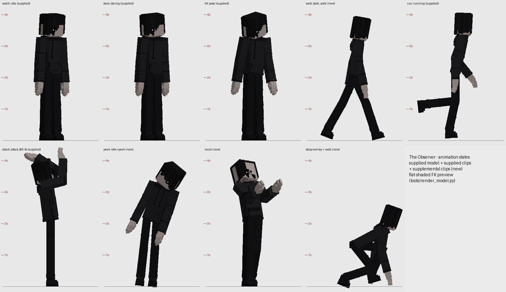

# The Observer — a Minecraft Bedrock horror add-on

> It follows you wherever you go. You rarely notice it directly. You notice that something around you is wrong.
> Over time, you realize it can manipulate your surroundings — and that the changes have a purpose.

The Observer is a tall, mouthless figure (the supplied *Hollow Dweller* model and animations) that studies one player
at a time. It follows you across the overworld, caves, water, sky bases, the Nether and the End; it imitates your
footsteps and your habits; it rearranges your home, seals the tunnel behind you, changes your familiar routes and takes
your light — always deliberately, always reversibly — and watches what you do about it.



## Install
1. Open **`dist/TheObserver.mcaddon`** with Minecraft Bedrock 1.26.50+ (or import the two `.mcpack` files).
2. Activate **The Observer (Behaviour)** on a world (the resource pack follows as a dependency). No experiments needed.
3. Play. Details: [docs/PLAYER_GUIDE.md](docs/PLAYER_GUIDE.md).

## Status
Server-side behaviour is verified on Bedrock Dedicated Server 1.26.52.3: the final integration run passed 165 of 165
checks with no content-log or script errors, restart recovery passed, and the server held 20 TPS with and without the
add-on. How it looks and sounds in a game client has **not** been checked yet: see
[docs/TEST_REPORT.md](docs/TEST_REPORT.md) §6 for the one manual pass needed before sharing it, and
[docs/RELEASE_READINESS.md](docs/RELEASE_READINESS.md) for known limitations.

## What's inside
* **One physical Observer** built on the supplied model: 5 supplied clips + 5 supplemental clips (stalking walk, peek,
  recoil, stoop crouch for low ceilings, head tracking), state-driven animation controllers, eye glints in darkness.
* **A horror director**: grace period, five escalating stages, per-player and global cooldowns, quiet periods,
  recovery after deaths, anti-repetition, context-weighted selection, fair multiplayer targeting.
* **18 encounter types**, including three signature encounters (*Out of Step*, *Someone Was Home*, *The Closed Path*),
  plus 17 further designed concepts — see [docs/ENCOUNTERS.md](docs/ENCOUNTERS.md).
* **8 environmental manipulation mechanics** (doors, lights, turned objects, Veil obstructions, mimic route changes,
  effigies, temporary openings, animals turning) through a **restoration ledger**: recorded, locked, reload-safe,
  dupe-proof, and the player's own changes always win.
* **Bounded memory** of each player: breadcrumbs, home, familiar routes, habits, a favoured bearing.
* **Progression**: 22 discoveries written in the Field Notes; Tally Chalk, Witness Lens, Ward Lantern, Vestiges; the
  Vigil as the long-term goal; three post-ending modes.
* **Settings**: Atmosphere / Standard / Relentless presets plus separate frequency, aggression, manipulation,
  sudden-scare, camera-effect and caption controls.
* **28 original synthesized sounds**, 7 particles, 3 fogs, original item and block art.

## Documentation
| Document | Contents |
|---|---|
| [docs/PLAYER_GUIDE.md](docs/PLAYER_GUIDE.md) | installing, tools, settings, accessibility, multiplayer, removal |
| [docs/DESIGN.md](docs/DESIGN.md) | identity, rules, systems, manipulation specs, director, signature encounters |
| [docs/ENCOUNTERS.md](docs/ENCOUNTERS.md) | the encounter library (18 implemented, 17 planned) |
| [docs/DEVELOPER_GUIDE.md](docs/DEVELOPER_GUIDE.md) | architecture, adding encounters, testing, tuning |
| [docs/FEATURE_MATRIX.md](docs/FEATURE_MATRIX.md) | feature → files → trigger → expected → test → status |
| [docs/TEST_REPORT.md](docs/TEST_REPORT.md) | what was tested, how, and the results; manual in-game procedure |
| [docs/RELEASE_READINESS.md](docs/RELEASE_READINESS.md) | known limitations and an honest release assessment |
| [docs/ASSET_RECORDS.md](docs/ASSET_RECORDS.md) | provenance of every shipped asset |

## Build and verify
```bash
npm install
npm run typecheck && npm run validate     # official typings + official JSON schemas + cross-references
python3 tools/build.py                    # -> dist/TheObserver.mcaddon, .mcpack files, SHA256SUMS.txt
python3 tests/bds/run_bds.py --bds <bedrock-server dir> --testkit --fresh --world suite \
        --scenario tests/bds/scenarios/suite_full.txt     # runtime tests on a dedicated server
```
